\
- **Pasif Saldırı**: Sistemdeki bilgileri öğrenmeye veya kullanmaya çalışır, ancak sistem kaynaklarını etkilemez.
- **Aktif Saldırı**: Sistem kaynaklarını değiştirmeye veya operasyonlarını etkilemeye çalışır.

- X.800'de iki özel kimlik doğrulama hizmeti vardır:
  - **Eş varlık kimlik doğrulaması**
  - **Veri kaynağı kimlik doğrulaması**

Geri dönüşümlü bir şifreleme mekanizması, verilerin şifrelenmesini ve daha sonra şifrelerinin çözülmesini sağlayan bir şifreleme algoritmasıdır.

- Geri dönüşümsüz şifreleme mekanizmaları, dijital imza ve ileti kimlik doğrulama uygulamalarında kullanılan **karma algoritmaları** ve **ileti kimlik doğrulama kodlarını** içerir.


A cryptographic hash function (CHF) is a hash algorithm (a map of an arbitrary binary string to a binary string with a fixed size of n bits) that has special properties desirable for a cryptographic application. A cryptographic hash function is a one-way function, meaning that it is computationally infeasible to invert the function and recover the original input from the output. The output of a cryptographic hash function is called a hash value or hash code. Cryptographic hash functions are used in various applications, including digital signatures, message authentication codes, and password hashing.

**Kriptografik bir karma işlevi (CHF)**, bir hash algoritmasıdır (keyfi bir ikili diziyi sabit boyutlu bir n bitlik ikili diziye eşleyen bir harita) ve kriptografik uygulamalar için özel olarak arzu edilen özelliklere sahiptir. Kriptografik bir karma işlevi, **tek yönlü bir işlevdir**, yani işlevi tersine çevirmek ve çıktıyı kullanarak orijinal girdiyi kurtarmak hesaplama açısından uygulanamaz. Kriptografik bir karma işlevinin çıktısına **karma değeri** veya **karma kodu** denir. Kriptografik karma işlevleri, **dijital imzalar**, **ileti kimlik doğrulama kodları** ve **parola karma işlemleri** gibi çeşitli uygulamalarda kullanılır.


**_ai_**

### Kriptografik Hash Fonksiyonları

Kriptografik bir hash fonksiyonu (CHF), keyfi uzunluktaki bir ikili diziyi sabit uzunlukta bir n-bitlik ikili diziye eşleyen bir algoritmadır. Bu fonksiyonlar, kriptografik uygulamalar için özel olarak tasarlanmış ve aşağıdaki özelliklere sahiptir:

1.  **Tek Yönlü İşlev**: Fonksiyonun çıktısından girdiyi hesaplama açısından geri elde etmek mümkün değildir.
2.  **Çarpışma Direnci**: Farklı iki girdinin aynı hash değerini üretmesi olasılığı düşüktür.
3.  **Hızlı Hesaplama**: Girdi verisinin hash değerini hızlı bir şekilde hesaplayabilir.

Kriptografik hash fonksiyonları, **dijital imzalar**, **mesaj kimlik doğrulama kodları (MAC)** ve **parola saklama** gibi birçok alanda kullanılır.

#### Örnek Python Kodu

Aşağıda, Python'da SHA-256 algoritmasını kullanarak bir metnin hash değerini hesaplayan bir örnek verilmiştir:

```python
import hashlib

def calculate_sha256_hash(data):
    # SHA-256 hash hesaplama
    sha256_hash = hashlib.sha256(data.encode()).hexdigest()
    return sha256_hash

# Örnek kullanım
text = "Merhaba Dünya"
hash_value = calculate_sha256_hash(text)
print(f"'{text}' metninin SHA-256 hash değeri: {hash_value}")

```

Bu kod, verilen bir metni SHA-256 algoritması ile hashleyerek çıktı olarak hash değerini döndürür.

### Tek Anahtarlı Algoritmalar (Simetrik Şifreleme)

Tek anahtarlı algoritmalar, şifreleme ve şifre çözme işlemleri için **aynı anahtarın** kullanıldığı algoritmalardır. Bu tür algoritmalar, genellikle **simetrik şifreleme** olarak adlandırılır. Tek anahtarlı algoritmaların temel özellikleri şunlardır:

1.  **Anahtar Yönetimi**: Anahtarın güvenli bir şekilde paylaşılması ve saklanması gerekmektedir.
2.  **Hız**: Genellikle daha hızlıdırlar ve büyük veri setlerini işlemek için uygundur.
3.  **Güvenlik**: Anahtarın gizliliği, sistemin güvenliğini doğrudan etkiler. Anahtarın ele geçirilmesi durumunda, şifreli verilerin güvenliği tehlikeye girebilir.

**_endofai_**

**_wiki_**

In cryptography, a **block cipher** is a deterministic algorithm that operates on fixed-length groups of bits, called blocks. Block ciphers are the elementary building blocks of many cryptographic protocols. They are ubiquitous in the storage and exchange of data, where such data is secured and authenticated via encryption.

A block cipher uses blocks as an unvarying transformation. Even a secure block cipher is suitable for the encryption of only a single block of data at a time, using a fixed key. A multitude of modes of operation have been designed to allow their repeated use in a secure way to achieve the security goals of confidentiality and authenticity. However, block ciphers may also feature as building blocks in other cryptographic protocols, such as universal hash functions and pseudorandom number generators.

Kriptografide, **blok şifreleyici (block cipher)**, sabit uzunlukta bit grupları (**bloklar**) üzerinde çalışan deterministik bir algoritmadır. Blok şifreleyiciler, birçok kriptografik protokolün temel yapı taşlarıdır. Verilerin saklanması ve iletilmesinde yaygın olarak kullanılırlar; bu veriler şifreleme yoluyla güvence altına alınır ve doğrulanır.

Bir blok şifreleyici, bloklar üzerinde değişmeyen bir dönüşüm uygular. Güvenli bir blok şifreleyici bile yalnızca sabit bir anahtar kullanarak tek bir veri bloğunu şifrelemek için uygundur. Gizlilik ve bütünlük hedeflerine ulaşmak için tekrar tekrar kullanılabilmelerini sağlayan birçok **çalışma modu** tasarlanmıştır. Ancak blok şifreleyiciler, **evrensel özetleme fonksiyonları** ve **sözde rastgele sayı üreticileri** gibi diğer kriptografik protokollerde de yapı taşı olarak kullanılabilir.


**\*endofwiki**

#### 🔐 Deterministik ve Deterministik Olmayan Algoritmalar

Kriptografi bağlamında algoritmalar genellikle **deterministik** ya da **deterministik olmayan (non-deterministic)** olarak sınıflandırılır.

---

##### ✅ Deterministik Algoritma Nedir?

Deterministik bir algoritma, **aynı girdiye her zaman aynı çıktıyı** verir. Bu algoritmalar rastgelelik içermez.

##### 📌 Özellikleri:

- Tahmin edilebilir.
- Test edilmesi ve hata ayıklanması kolaydır.
- Şifreleme algoritmalarının bazı yönleri (örneğin AES bloğu) deterministiktir.

💡 Örnek:
AES ile ECB modunda bir blok şifreleme:

```plaintext
Girdi: "merhaba123"
Anahtar: "gizli_anahtar"
→ Şifreli çıktı: "XJ38SAB998ZZ"

Tekrar aynı girdiyi verirsek:
Girdi: "merhaba123"
Anahtar: "gizli_anahtar"
→ Şifreli çıktı: yine "XJ38SAB998ZZ"
```

---

##### ❎ Deterministik Olmayan (Non-Deterministic) Algoritma Nedir?

Aynı girdiye farklı zamanlarda farklı çıktılar verebilen, rastgelelik içeren algoritmalardır.

##### 📌 Özellikleri:

- Güvenliği artırır (örneğin tekrar eden verileri gizlemek için).
- Doğrulama işlemleri daha karmaşık olabilir.
- Rastgele sayı üreten algoritmalar veya **IV (Initialization Vector - Başlatma Vektörü)** kullanan şifreleme modları örnektir.

💡 Örnek:
AES ile CBC modunda blok şifreleme (IV ile):

```plaintext
Girdi: "merhaba123"
Anahtar: "gizli_anahtar"
IV: rastgele
→ Şifreli çıktı: "7AS2KLZ188"

Aynı girdiyi tekrar verirsek:
Yeni IV: farklı rastgele değer
→ Şifreli çıktı: "P9QWERT123" (farklı bir çıktı)
```

---

#### 🔄 Karşılaştırma Tablosu

| **Özellik**            | **Deterministik Algoritma**  | **Non-Deterministik Algoritma** |
| ---------------------- | ---------------------------- | ------------------------------- |
| Girdi tekrarında çıktı | Aynı                         | Farklı olabilir                 |
| Rastgelelik            | Yok                          | Var                             |
| Kriptografik kullanım  | Hash fonksiyonları, ECB modu | CBC modu, IV kullanımı          |
| Doğrulama kolaylığı    | Kolay                        | Zor                             |

---

#### 📌 Sonuç

- Deterministik algoritmalar sistematik ve öngörülebilirdir.
- Non-deterministik algoritmalar ise güvenlik açısından daha güçlüdür ancak kontrol edilmesi daha zordur.

### Akış Şifreleme

Bu şifrelemedeki amaç yöntem olarak bir akışı kullanmaktır. Yani her şifreleme birimindeki işlem bir önceki şifreleme işlemine bağlıdır. Örneğin her harfin şifrelenmesi sırasında bir önceki şifrelemeden çıkan bilgi anahtar olarak kullanılabilir veya anahtar kendi içerisinde çeşitli formüllere tabi tutularak bir sonraki anahtar bilgilerini üretebilir.

### Mesaj Doğrulama Kodu (MAC - Message Authentication Code)

**Mesaj Doğrulama Kodu (MAC)**, kriptografi biliminde mesajın bütünlüğünü teyit etmek için mesaja eklenen birkaç baytlık veri kümesidir. Genellikle **MAC (MDK)** olarak adlandırılır ve kriptografik özet fonksiyon olarak da bilinir. **Özel Anahtar (Private Key)** ile birlikte MDK algoritması kullanılarak bir özet çıktı elde edilir. Bu özet çıktıya **Mesaj Doğrulama Kodu** denir. Böylelikle alıcı tarafta gizli anahtara sahip olan kişi mesajın doğruluğunu kontrol edebilir.

Gönderici, MDK oluşturmak için Özel Anahtar ile MDK algoritması kullanarak elde ettiği özeti, mesajla alıcı tarafına gönderir. Alıcı, kendisine gelen bu mesajı sadece kendisinde ve göndericide olan bu özel anahtar ile MDK algoritmasını kullanarak tekrar bir özet değer üretir. Oluşan bu özet, yani Mesaj Doğrulama Kodu, gönderici tarafından mesaja eklenerek gelen MDK ile karşılaştırılır. Eğer bu özet değerler birbirine eşitse mesaj bütünlüğü korunmuş olur. Şayet bu özet değerler birbirine uyuşmazsa mesaj içeriğinin değiştirildiği ve bütünlüğünün korunmadığı anlamına gelir. Bir diyagram ile özetlersek:


Bu yöntemin birincil dezavantajı, mesajı değişikliklere karşı koruma eksikliğidir. MDK'lar mesajın bütünlüğünü doğrularken mesajın gizliliğini sağlamada yetersizdir. Çünkü saldıran kişi özel anahtarı elde ederse, istediği mesajları bu anahtarı kullanarak oluşturabilir ve geçerli MDK'lar üretebilir. Burada saldırganın MDK'yı üreten algoritmayı özel anahtar ile geri elde etmeye çalışırken başka mesajlara karşılık gelen MDK'yı olası bir zaman içerisinde elde edememesi hedeflenir.

MDK'ları, **dijital imzadan** ayıran en belirgin özelliklerden biri, üretme ve doğrulama tarafının tek bir anahtar ile yapılmasıdır. Dijital imza ise **genel anahtar (public key)** ve **özel anahtar (private key)** olarak 2 anahtar kullanır. MDK'yı oluşturmak ve doğrulamak DES'e (Data Encryption Standard) dayanır, yani **simetrik şifreleme** yapısına sahiptir. Dijital imza ise **asimetrik bir yapıya** sahiptir. Dijital imzadaki genel ve özel anahtar birbiriyle matematiksel olarak bağlantılıdır ama genel anahtardan özel anahtara ulaşılamaz. Bu özellik mesajın kim tarafından oluşturulduğunu ve kime ait olduğunu kanıtladığından dolayı mesaj bütünlüğünün yanında **kimliğin inkar edilemezliliğini (non-repudiation)** sağlar. MDK'lar bu inkar edilemezliği sağlayamadığından ötürü dijital imzalardan ayrılan bir diğer özelliktir.

### Asimetrik Algoritmalar (Açık Anahtarlı Şifreleme)

Tek bir anahtar ile şifreleme ve şifre çözme işlemi yapılmaz. Her iki işlem için farklı anahtarlar kullanılır. Bu anahtarlara **genel anahtar (public key)** ve **özel anahtar (private key)** denir. Genel anahtar herkesle paylaşılabilirken, özel anahtar sadece sahibinde bulunur. Genel anahtar ile şifrelenmiş bir mesaj sadece o mesajın özel anahtarı ile çözülebilir. Bu özellik, asimetrik algoritmaların güvenliğini sağlar.

Asimetrik algoritmalar, genellikle daha yavaş çalışır ve daha fazla işlem gücü gerektirir. Ancak, güvenlik açısından daha güçlüdürler ve anahtar yönetimi açısından daha fazla esneklik sunarlar. Asimetrik algoritmalar, genellikle **dijital imzalar**, **anahtar değişimi** ve **kimlik doğrulama** gibi uygulamalarda kullanılır.

Asimetrik algoritmaların en yaygın örnekleri **RSA**, **DSA** ve **ECC**'dir. Bu algoritmalar, genellikle büyük asal sayılar ve matematiksel işlemler kullanarak güvenlik sağlarlar. Asimetrik algoritmalar, genellikle simetrik algoritmalarla birlikte kullanılır. Örneğin, bir simetrik anahtarın güvenli bir şekilde iletilmesi için asimetrik algoritmalar kullanılabilir.

--- iletişim güvenliği ve cihaz güvenliği atlandı --endofchapter1---

bölünürlük atlandı **common knowledge**
öklid ebob ekok atlandı **common knowledge**

### Öklid Algoritması ile EBOB Hesaplama

Öklid algoritması, iki sayının **en büyük ortak bölenini (EBOB)** bulmak için kullanılan etkili bir yöntemdir. Bu algoritma, büyük sayılar için bile hızlı bir şekilde sonuç verir.

#### Python Örneği

Aşağıda, Öklid algoritmasını kullanarak iki sayının EBOB'unu hesaplayan bir Python kodu verilmiştir:

```python
def gcd(a, b):
    """İki sayının EBOB'unu Öklid algoritması ile hesaplar."""
    while b != 0:
        a, b = b, a % b
    return a

# Örnek kullanım
sayi1 = 48
sayi2 = 18
ebob_degeri = gcd(sayi1, sayi2)
print(f"{sayi1} ve {sayi2} sayılarının EBOB'u: {ebob_degeri}")
```

Bu kod, iki sayının EBOB'unu hesaplamak için Öklid algoritmasını uygular. `a % b` işlemi, `a` sayısının `b` sayısına bölümünden kalanını verir ve bu işlem, kalan sıfır olana kadar tekrarlanır.

#### Matematiksel İfade ve Örnek

Öklid algoritması şu şekilde çalışır:

1.  İki sayı alın: \( a \) ve \( b \) (burada \( a > b \)).
2.  \( a \mod b \) işlemini gerçekleştirin ve sonucu \( r \) olarak adlandırın.
3.  Eğer \( r = 0 \) ise, \( b \) EBOB'dur.
4.  Eğer \( r \neq 0 \) ise, \( a \) yerine \( b \) ve \( b \) yerine \( r \) koyarak işlemi tekrarlayın.

**Örnek:**

\( a = 48 \), \( b = 18 \)

1.  \( 48 \mod 18 = 12 \) (kalan \( 12 \))
2.  \( 18 \mod 12 = 6 \) (kalan \( 6 \))
3.  \( 12 \mod 6 = 0 \) (kalan \( 0 \))

Sonuç: \( \text{EBOB}(48, 18) = 6 \)


### Fermat'ın Küçük Teoremi (Fermat's Little Theorem)

Fermat'ın Küçük Teoremi, asal sayılarla ilgili önemli bir teoremdir. Bu teorem, asal sayılar ve modüler aritmetik ile ilgili birçok kriptografik uygulamada kullanılır.

Teorem, aşağıdaki şekilde ifade edilir:
Eğer **p asal bir sayı** ve **a, p ile tam bölünmeyen bir tam sayı** ise, o zaman:
$$ a^{p-1} \equiv 1 \pmod{p} $$
Bu teorem, asal sayılarla yapılan birçok kriptografik algoritmanın temelini oluşturur. Özellikle **RSA şifreleme algoritmasında** bu teorem kullanılır.

### Euler Totient Teoremi

Euler Totient Teoremi, kriptografide özellikle **RSA algoritmasında** kullanılan önemli bir matematiksel teoremdir. Bu teoremi anlamak için önce birkaç temel kavramı açıklayalım:

#### 1. Totient Fonksiyonu (φ)

**Totient fonksiyonu φ(n)**, n'den küçük ve n ile aralarında asal olan pozitif tam sayıların sayısını verir.

**Örnek:**

-   n = 8 için:
    -   1, 2, 3, 4, 5, 6, 7 sayılarından
    -   8 ile aralarında asal olanlar: 1, 3, 5, 7
    -   Yani **φ(8) = 4**
-   n = 7 için (7 asal sayı):
    -   1, 2, 3, 4, 5, 6 sayılarından
    -   7 ile aralarında asal olanlar: 1, 2, 3, 4, 5, 6
    -   Yani **φ(7) = 6**

#### 2. Teoremin İfadesi

Eğer:

-   **n pozitif bir tam sayı**
-   **a, n ile aralarında asal bir tam sayı**
    ise:
    $$ a^{\phi(n)} \equiv 1 \pmod{n} $$

#### 3. Pratik Örnek

n = 7 ve a = 3 alalım:

1.  φ(7) = 6 (yukarıda hesapladık)
2.  3⁶ = 729
3.  729'u 7'ye böldüğümüzde kalan 1'dir (729 = 104 * 7 + 1)
4.  Yani **3⁶ ≡ 1 (mod 7)**

#### 4. RSA'daki Önemi

RSA algoritmasında bu teorem şu şekilde kullanılır:

1.  İki büyük asal sayı seçilir (p ve q)
2.  n = p × q hesaplanır
3.  φ(n) = (p-1) × (q-1) hesaplanır
4.  Bu değerler kullanılarak şifreleme ve şifre çözme anahtarları oluşturulur

#### 5. Güvenlik Açısından Önemi

-   Teorem, büyük sayıların modüler üstel işlemlerinde kullanılır.
-   RSA'nın güvenliği, φ(n) değerinin hesaplanmasının zorluğuna dayanır.
-   Büyük asal sayıların çarpanlarına ayrılması çok zor olduğu için sistem güvenlidir.

#### 6. Basit Bir Şifreleme Örneği

n = 15 ve a = 2 alalım:

1.  φ(15) = φ(3*5) = (3-1)*(5-1) = 2*4 = 8 (15'ten küçük ve 15 ile aralarında asal sayılar: 1, 2, 4, 7, 8, 11, 13, 14)
2.  2⁸ = 256
3.  256 ≡ 1 (mod 15) (256 = 17 * 15 + 1)
4.  Bu, şifreleme işlemlerinde kullanılabilecek bir matematiksel ilişki sağlar.

Bu teorem, modern kriptografinin temelini oluşturan önemli bir matematiksel yapı taşıdır ve özellikle asimetrik şifreleme sistemlerinde kritik bir rol oynar.

### Miller-Rabin Asallık Testi

**Miller-Rabin asallık testi**, asal sayıları test etmek için kullanılan olasılıksal bir algoritmadır. Bu algoritma, belirli bir sayının asal olup olmadığını yüksek bir olasılıkla belirlemek için rastgele sayılar kullanır. Miller-Rabin testi, özellikle büyük asal sayılar için etkilidir ve genellikle **RSA şifreleme algoritmasında** anahtar üretimi sırasında kullanılır.

Algoritmanın temel adımları şunlardır:

1.  Test edilecek sayıyı **n** olarak adlandıralım ve **n-1** sayısını **d * 2<sup>r</sup>** şeklinde yazalım (d tek sayı).
2.  Rastgele bir **a** sayısı seçelim (1 < a < n-1).
3.  **x = a<sup>d</sup> (mod n)** hesaplayalım.
4.  Eğer **x ≡ 1 (mod n)** veya **x ≡ n-1 (mod n)** ise, n **asal olabilir**. Testi farklı a değerleri ile tekrarlamak gerekir.
5.  Aksi takdirde, **r-1** kez döngü yaparak x değerini güncelleyelim:
    -   **x = x² (mod n)**
    -   Eğer **x ≡ n-1 (mod n)** ise, n **asal olabilir**. Döngüden çıkılır.
6.  Eğer döngü bittiğinde **x ≡ n-1 (mod n)** elde edilemezse, n **kesinlikle asal değildir**.

Bu test, belirli sayıda farklı 'a' değeri için tekrarlanarak sonucun güvenilirliği artırılır.

### Çin Kalan Teoremi

**Çin Kalan Teoremi**, modüler aritmetik ile ilgili önemli bir teoremdir. Bu teorem, birden fazla modül altında eşanlı kongrüans sistemlerini çözmemize yardımcı olur. Özellikle kriptografik uygulamalarda (örneğin RSA'da hesaplamaları hızlandırmak için) ve sayısal hesaplamalarda kullanılır.

#### Teorem

Eğer **n₁, n₂, ..., nₖ ikişer ikişer aralarında asal** pozitif tam sayılar ve **a₁, a₂, ..., aₖ** tam sayılar verilmişse, o zaman aşağıdaki kongrüans sisteminin **tek bir çözümü** vardır (mod N = n₁ · n₂ · ... · nₖ):

$$ x \equiv a_1 \pmod{n_1} $$
$$ x \equiv a_2 \pmod{n_2} $$
$$ \vdots $$
$$ x \equiv a_k \pmod{n_k} $$

Bu sistemin çözümü, **N = n₁ · n₂ · ... · nₖ** ve **Nᵢ = N/nᵢ** olmak üzere, her bir Nᵢ'nin mod nᵢ'deki tersi (yᵢ) kullanılarak bulunabilir:
$$ x \equiv \sum_{i=1}^{k} a_i N_i y_i \pmod{N} $$
Burada **yᵢ ≡ Nᵢ⁻¹ (mod nᵢ)**'dir.

#### Örnek

Örnek olarak, aşağıdaki sistem verilsin:

$$ x \equiv 2 \pmod{3} $$
$$ x \equiv 3 \pmod{4} $$
$$ x \equiv 2 \pmod{5} $$

Bu sistemin çözümünü bulmak için:

1.  Modüller (3, 4, 5) ikişer ikişer aralarında asaldır.
2.  N = 3 · 4 · 5 = 60
3.  N₁ = 60/3 = 20
4.  N₂ = 60/4 = 15
5.  N₃ = 60/5 = 12
6.  Her bir Nᵢ için mod nᵢ'deki tersini bulalım:
    -   y₁ ≡ 20⁻¹ (mod 3) ≡ 2⁻¹ (mod 3) ≡ 2 (mod 3)  (çünkü 20 * 2 = 40 ≡ 1 mod 3)
    -   y₂ ≡ 15⁻¹ (mod 4) ≡ 3⁻¹ (mod 4) ≡ 3 (mod 4)  (çünkü 15 * 3 = 45 ≡ 1 mod 4)
    -   y₃ ≡ 12⁻¹ (mod 5) ≡ 2⁻¹ (mod 5) ≡ 3 (mod 5)  (çünkü 12 * 3 = 36 ≡ 1 mod 5)
7.  Bu tersleri kullanarak x değerini hesaplayalım:
    x ≡ a₁ · N₁ · y₁ + a₂ · N₂ · y₂ + a₃ · N₃ · y₃ (mod N)
    x ≡ (2 · 20 · 2) + (3 · 15 · 3) + (2 · 12 · 3) (mod 60)
    x ≡ 80 + 135 + 72 (mod 60)
    x ≡ 287 (mod 60)
    x ≡ 47 (mod 60)

Çözüm: x = 47 (veya 47 + 60k formundaki tüm sayılar). Kontrol edelim:
47 mod 3 = 2 (Doğru)
47 mod 4 = 3 (Doğru)
47 mod 5 = 2 (Doğru)

### Özet (Bölüm 2)

-   Bölünebilirlik kavramını ve bölme algoritmasını anladık.
-   Fermat'ın Küçük Teoremini anladık.
-   Euler Totient Teoremini anladık.
-   En büyük ortak böleni bulmak için Öklid algoritmasını nasıl kullanacağımızı öğrendik.
-   Euler'in totient işlevini tanımladık.
-   Asallık testi (Miller-Rabin) konusunda bir sunum yaptık.
-   Modüler aritmetik kavramlarına yönelik genel bir bakış sunduk.
-   Çin Kalan Teoremini açıkladık.
-   Genişletilmiş Öklid algoritmasının işleyişini açıkladık (EBOB'u lineer kombinasyon olarak ifade etme ve modüler ters bulma).
-   Ayrık logaritmaları tanımladık (modüler aritmetikte logaritma benzeri işlem).
-   Asal sayılarla ilgili temel kavramları tartıştık.

**endofchapter2**

***tanımlar atlandı common***

### Simetrik Şifreleme

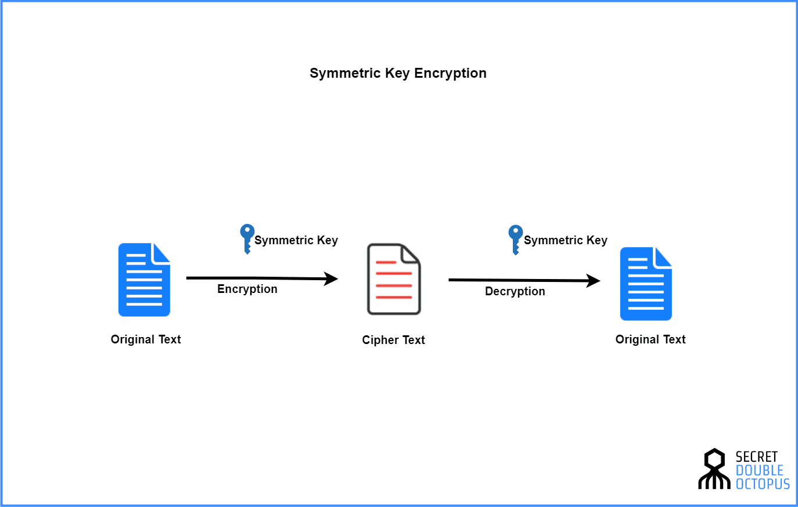

**Simetrik şifreleme**, aynı anahtarın hem şifreleme hem de şifre çözme işlemlerinde kullanıldığı bir şifreleme yöntemidir. Bu tür algoritmalar, genellikle daha hızlıdır ve büyük veri setlerini işlemek için uygundur. Ancak, anahtarın güvenli bir şekilde paylaşılması ve saklanması gerekmektedir.

Simetrik şifreleme algoritmaları, genellikle **blok şifreleme** ve **akış şifreleme** olarak iki ana kategoriye ayrılır:

1.  **Blok Şifreleme**: Veriyi sabit boyutlu bloklar halinde işler. Her blok, belirli bir algoritma ile şifrelenir. Örnek: **AES**, **DES**.
2.  **Akış Şifreleme**: Veriyi bit bit veya bayt bayt işler. Her bit veya bayt, belirli bir algoritma ile şifrelenir. Örnek: **RC4**.

### Sezar Şifrelemesi

Sezar şifrelemesi, bir metindeki her harfi alfabede belirli bir sayıda (**kaydırma miktarı**) ileri veya geri kaydırarak şifreleme yapan basit bir **yerine koyma (substitution)** şifreleme yöntemidir. Örneğin, her harfi 3 harf ileri kaydırarak şifreleme yaparsak, "A" harfi "D" olur, "B" harfi "E" olur vb.

Bu yöntem, özellikle tarihsel olarak Roma İmparatorluğu döneminde Julius Sezar tarafından kullanılmıştır. Sezar şifrelemesi, basitliği nedeniyle günümüzde güvenli bir şifreleme yöntemi olarak kabul edilmez (frekans analizi ile kolayca kırılabilir), ancak temel kriptografi kavramlarını anlamak için iyi bir örnektir.

Alfabenin her harfini, alfabenin **k** adım aşağısında (veya yukarısında) duran harfle değiştirmeyi içerir.
*   Alfabe, Z'yi takip eden harf A olacak şekilde dairesel olarak düşünülür.

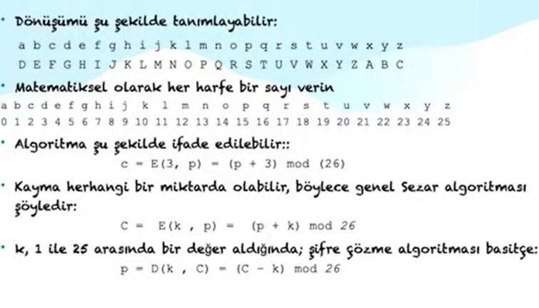

### Monoalfabetik Şifreleme

Monoalfabetik şifreleme, her düz metin harfinin **sabit** bir şifreli metin harfiyle değiştirildiği bir yerine koyma şifreleme yöntemidir. Bu yöntemde, her harf için belirli bir eşleşme (permütasyon) oluşturulur ve bu eşleşme metin boyunca sabit kalır. Örneğin, "A" harfi "D" ile, "B" harfi "E" ile, "C" harfi "X" ile eşleştirilebilir.

Bu tür şifreleme, Sezar şifrelemesine benzer ancak daha karmaşık bir eşleşme kullanabilir (Sezar sadece basit bir kaydırmadır). Ancak, monoalfabetik şifrelemeler de harf frekanslarını koruduğu için **frekans analizi** saldırılarına karşı savunmasızdır.

### Permütasyon (Monoalfabetik Şifrelemede Anahtar Uzayı)

-   Sonlu bir elemanlar kümesinden \( S \), \( S \)'nin tüm elemanlarının sıralı bir dizisidir ve her eleman tam olarak bir kez görünür.
-   Eğer "şifre" satırı (yani şifreleme alfabesi), 26 alfabetik karakterin herhangi bir permütasyonu olabilirse, o zaman \( 26! \) (yaklaşık \( 4 \times 10^{26} \))'dan fazla olası anahtar vardır.
-   Bu, DES için anahtar alanından (2⁵⁶ ≈ 7.2 x 10¹⁶) çok daha büyüktür.
-   Yaklaşım, **tek alfabetik ikame şifresi** olarak adlandırılır, çünkü ileti başına tek bir şifreleme alfabesi kullanılır.

-   Orijinal alfabenin frekans verilerini yansıttıkları için kırılması kolaydır.
-   **Homofonik Şifreleme**: Tek bir düz metin harfi için birden fazla şifreli metin ikamesi (homofon) sağlayarak frekans analizini zorlaştırmaya çalışır.
-   **Digram**: İki harfli kombinasyonlar.
    -   En yaygın olanı "th" (İngilizce için).
-   **Trigram**: Üç harfli kombinasyonlar.
    -   Örneğin, "the" (İngilizce için).

## Playfair Şifrelemesi

**Playfair şifrelemesi**, iki harfli bloklar (**digramlar**) halinde çalışan bir **digramatik yerine koyma** şifreleme yöntemidir. Bu yöntemde, her digram, 5x5'lik bir anahtar matrisi kullanılarak şifrelenir. Playfair şifrelemesi, monoalfabetik şifrelemeden daha güvenlidir çünkü tek harf frekanslarını gizler, ancak digram frekansları hala analiz edilebilir.

### Anahtar Matrisinin Oluşturulması

1.  Bir **anahtar kelime** belirleyin ve tekrar eden harfleri çıkarın.
2.  Anahtar kelimenin benzersiz harflerini 5x5'lik bir matrise soldan sağa, yukarıdan aşağıya yerleştirin.
3.  Geriye kalan alfabedeki harfleri alfabetik sırayla matrisin boş hücrelerine ekleyin. Genellikle "I" ve "J" harfleri aynı hücreyi paylaşır (veya biri atlanır, örn. "Q").

### Şifreleme Adımları

1.  Düz metni iki harfli bloklara ayırın.
    -   Eğer bir blokta aynı iki harf varsa (örn. "LL"), araya genellikle "X" gibi bir dolgu harfi ekleyin ("LX", "L").
    -   Eğer metin tek sayıda harf içeriyorsa, sonuna bir dolgu harfi ("X") ekleyin.
2.  Her digram (örn. AB) için matristeki harflerin konumuna göre aşağıdaki kuralları uygulayın:
    -   **Aynı Satır**: Harfler aynı satırdaysa, her harfi sağındaki harfle değiştirin (satırın sonundaki harf, satırın başındaki harfle değiştirilir).
    -   **Aynı Sütun**: Harfler aynı sütundaysa, her harfi altındaki harfle değiştirin (sütunun sonundaki harf, sütunun başındaki harfle değiştirilir).
    -   **Farklı Satır ve Sütun (Dikdörtgen)**: Harfler farklı satır ve sütundaysa, her harfi kendi satırında, diğer harfin sütunundaki harfle değiştirin (oluşan dikdörtgenin karşı köşelerindeki harfler).

#### Örnek

Anahtar kelime: "KRIPTO" (Tekrarlanan harf yok)
Alfabe: (I/J aynı hücrede) A B C D E F G H I/J K L M N O P Q R S T U V W X Y Z

Anahtar matrisi:
```
K R I/J P T
O A B C D
E F G H L
M N Q S U
V W X Y Z
```

Düz Metin: "MERHABA DUNYA"

1.  Hazırlık: ME RH AB AD UN YA (Araya 'X' eklemeye gerek kalmadı, sonu çift)
2.  Şifreleme:
    -   ME → NF (Dikdörtgen: M satırı E sütunu -> N, E satırı M sütunu -> F)
    -   RH → CI/J (Dikdörtgen: R satırı H sütunu -> C, H satırı R sütunu -> I/J)
    -   AB → OC (Aynı satır: A->O, B->C)
    -   AD → TC (Aynı satır: A->T, D->C)
    -   UN → YM (Dikdörtgen: U satırı N sütunu -> Y, N satırı U sütunu -> M)
    -   YA → BW (Dikdörtgen: Y satırı A sütunu -> B, A satırı Y sütunu -> W)

Şifreli metin: "NF CI/J OC TC YM BW"

### Hill Şifrelemesi

Hill şifrelemesi, bir metni şifrelemek için **lineer cebir** (matris çarpımı) kullanan bir **poligrafik blok şifreleme** yöntemidir. Bu yöntem, bir metni belirli bir boyuttaki (m) bloklara ayırır ve her bloğu m x m boyutunda terslenebilir bir anahtar matrisi ile çarparak şifreler (mod 26).

#### Şifreleme Adımları

1.  **Anahtar Matrisi (K)**:
    -   Anahtar, m x m boyutunda kare bir matris olarak seçilir (m, blok boyutudur).
    -   Harfler sayılara dönüştürülür (A=0, B=1, ..., Z=25).
    -   Anahtar matrisinin determinantı, mod 26'da 0 olmamalı ve 26 ile aralarında asal olmalıdır (yani mod 26'da tersi bulunabilmelidir).

2.  **Metni Bloklara Ayırma (P)**:
    -   Düz metin, m uzunluğunda bloklara ayrılır.
    -   Her blok bir sütun vektörü olarak temsil edilir.
    -   Eğer metin uzunluğu m'nin tam katı değilse, eksik kısımlar genellikle "X" gibi dolgu harfleri ile tamamlanır.

3.  **Şifreleme İşlemi (C)**:
    -   Her düz metin bloğu (P), anahtar matrisi (K) ile çarpılır ve sonuç mod 26 alınır: **C = K * P (mod 26)**.

4.  **Şifreli Metni Oluşturma**:
    -   Çıkan sayısal vektörler tekrar harflere dönüştürülerek şifreli metin elde edilir.

#### Örnek (m=2)

Anahtar matrisi (K):
```
| 3  3 |
| 2  5 |
```
Determinant = (3*5) - (3*2) = 15 - 6 = 9. EBOB(9, 26) = 1, yani matris mod 26'da terslenebilir.

Düz Metin (P): "HELLO"

1.  **Bloklara Ayırma ve Sayısallaştırma**:
    -   "HE" → [7, 4]ᵀ
    -   "LL" → [11, 11]ᵀ
    -   "O" → "OX" → [14, 23]ᵀ (Dolgu harfi 'X' eklendi)

2.  **Şifreleme**:
    -   Blok 1 ("HE"):
        ```
        | 3  3 | * | 7 | = | 3*7 + 3*4 | = | 33 | ≡ | 7 | (mod 26) -> H
        | 2  5 |   | 4 |   | 2*7 + 5*4 |   | 34 | ≡ | 8 | (mod 26) -> I
        ```
        Şifreli blok 1: "HI"
    -   Blok 2 ("LL"):
        ```
        | 3  3 | * | 11 | = | 3*11 + 3*11 | = | 66 | ≡ | 14 | (mod 26) -> O
        | 2  5 |   | 11 |   | 2*11 + 5*11 |   | 77 | ≡ | 25 | (mod 26) -> Z
        ```
        Şifreli blok 2: "OZ"
    -   Blok 3 ("OX"):
        ```
        | 3  3 | * | 14 | = | 3*14 + 3*23 | = | 42 + 69 | = | 111 | ≡ | 7 | (mod 26) -> H
        | 2  5 |   | 23 |   | 2*14 + 5*23 |   | 28 + 115| = | 143 | ≡ | 13 | (mod 26) -> N
        ```
        Şifreli blok 3: "HN"

3.  **Şifreli Metin**:
    -   Şifreli metin: "HIOZHN"

#### Çözme İşlemi

Şifreli metni çözmek için anahtar matrisinin mod 26'ya göre tersini (K⁻¹) alarak şifreli blokları (C) bu ters matrisle çarparız: **P = K⁻¹ * C (mod 26)**.

#### Avantajlar

-   Hill şifrelemesi, blok şifreleme olduğu için tek harf frekans analizine karşı dayanıklıdır. Digram, trigram vb. frekanslarını da önemli ölçüde gizler.
-   Matematiksel olarak güçlü bir yapıya sahiptir.

#### Dezavantajlar

-   Anahtar matrisinin terslenebilir olması gerekliliği, anahtar seçimini kısıtlar.
-   Bilinen düz metin saldırılarına karşı savunmasızdır (eğer yeterli sayıda düz metin/şifreli metin çifti bilinirse, anahtar matrisi lineer denklem sistemi çözülerek bulunabilir).
-   Büyük boyutlu matrisler, işlem karmaşıklığını artırabilir.

### Vigenère Şifrelemesi

Vigenère şifrelemesi, bir metni şifrelemek için bir **anahtar kelime** kullanan bir **polialfabetik yerine koyma** şifreleme yöntemidir. Bu yöntem, her düz metin harfini, anahtar kelimenin karşılık gelen harfine göre farklı miktarlarda kaydırarak şifreler. Vigenère şifrelemesi, monoalfabetik şifrelemeden daha güvenlidir çünkü aynı düz metin harfi metin içinde farklı şifreli harflere dönüşebilir, bu da basit frekans analizini engeller.

#### Anahtar Kelime

Anahtar kelime, şifreleme işlemi sırasında kullanılacak olan kelimedir. Anahtar kelimenin uzunluğu, şifrelenecek metnin uzunluğuna göre ayarlanır. Eğer anahtar kelime metinden kısa ise, metin uzunluğuna ulaşana kadar **tekrarlanır**.

#### Şifreleme Adımları

1.  **Anahtar Kelimeyi Uzatma**: Anahtar kelime, şifrelenecek metnin uzunluğuna kadar tekrarlanarak uzatılır.
2.  **Şifreleme İşlemi**: Her düz metin harfi, uzatılmış anahtar kelimenin karşılık gelen harfi ile (genellikle Vigenère tablosu veya modüler aritmetik kullanılarak) birleştirilir/kaydırılır.
    -   Modüler Aritmetik: Harfleri sayılara dönüştür (A=0, ..., Z=25). Şifreli harf Cᵢ = (Pᵢ + Kᵢ) mod 26.
3.  **Şifreli Metni Oluşturma**: Şifreleme işlemi sonucunda elde edilen harfler birleştirilerek şifreli metin oluşturulur.

#### Örnek

Anahtar kelime: "KELIME"
Düz Metin: "MERHABA"

1.  **Anahtar Kelimeyi Uzatma**:
    ```
    Düz Metin:  M E R H A B A
    Anahtar:    K E L I M E K
    ```

2.  **Şifreleme İşlemi (Mod 26)**:
    Harfleri sayılara dönüştür:
    M=12, E=4, R=17, H=7, A=0, B=1
    K=10, E=4, L=11, I=8, M=12

    -   (M + K) mod 26 = (12 + 10) mod 26 = 22 → W
    -   (E + E) mod 26 = (4 + 4) mod 26 = 8 → I
    -   (R + L) mod 26 = (17 + 11) mod 26 = 28 mod 26 = 2 → C
    -   (H + I) mod 26 = (7 + 8) mod 26 = 15 → P
    -   (A + M) mod 26 = (0 + 12) mod 26 = 12 → M
    -   (B + E) mod 26 = (1 + 4) mod 26 = 5 → F
    -   (A + K) mod 26 = (0 + 10) mod 26 = 10 → K

3.  **Şifreli Metin**:
    ```
    WICPMFK
    ```
    *(Önceki örnekte H+I=V olarak hesaplanmış, doğrusu P olmalıydı. Düzeltildi.)*

### Vernam Şifresi (One-Time Pad ile İlişkili)

Vernam şifresi, bir metni şifrelemek için **rastgele bir anahtar** kullanarak her düz metin bitini (veya karakterini) anahtarın karşılık gelen bitiyle (veya karakteriyle) **XOR (exclusive OR)** işlemi ile birleştiren bir yöntemdir.

Vernam şifresi, genellikle **Tek Seferlik Bloknot (One-Time Pad - OTP)** olarak adlandırılan ve teorik olarak kırılması imkansız olan şifreleme yöntemiyle yakından ilişkilidir. OTP'nin kırılmaz olması için şu koşullar sağlanmalıdır:

1.  **Anahtar Tamamen Rastgele Olmalı**: Anahtar dizisi gerçekten rastgele üretilmelidir.
2.  **Anahtar Metin Kadar Uzun Olmalı**: Anahtarın uzunluğu en az şifrelenecek metin kadar olmalıdır.
3.  **Anahtar Sadece Bir Kez Kullanılmalı**: Aynı anahtar asla birden fazla mesaj için kullanılmamalıdır.
4.  **Anahtar Gizli Tutulmalı**: Anahtar hem gönderici hem de alıcı tarafından mutlak gizlilik içinde saklanmalıdır.

#### Şifreleme Adımları (Bit düzeyinde XOR)

1.  **Anahtar Oluşturma**: Düz metinle aynı uzunlukta, tamamen rastgele bir bit dizisi (anahtar) oluşturulur.
2.  **XOR İşlemi**: Düz metnin her biti, anahtarın karşılık gelen biti ile XOR işlemine tabi tutulur.
    -   0 XOR 0 = 0
    -   0 XOR 1 = 1
    -   1 XOR 0 = 1
    -   1 XOR 1 = 0
3.  **Şifreli Metni Oluşturma**: XOR işlemi sonucunda elde edilen bit dizisi şifreli metindir.
4.  **Şifre Çözme**: Alıcı, şifreli metni aynı anahtarla tekrar XOR işlemine tabi tutarak orijinal düz metni elde eder (çünkü (P XOR K) XOR K = P).

#### Örnek (Karakter düzeyinde, ASCII ve XOR varsayımıyla - pratikte bit düzeyinde yapılır)

Anahtar: "RANDM" (Metinle aynı uzunlukta ve rastgele varsayılıyor)
Metin: "HELLO"

1.  **ASCII Değerleri**:
    H=72, E=69, L=76, L=76, O=79
    R=82, A=65, N=78, D=68, M=77
2.  **XOR İşlemi (Decimal)**:
    -   72 XOR 82 = 26
    -   69 XOR 65 = 4
    -   76 XOR 78 = 6
    -   76 XOR 68 = 12
    -   79 XOR 77 = 6
3.  **Şifreli Metin (ASCII Karşılıkları)**:
    26 (SUB), 4 (EOT), 6 (ACK), 12 (FF), 6 (ACK) - Genellikle yazdırılamayan karakterler çıkar. Bu nedenle bit düzeyinde işlem daha anlamlıdır.

#### Önemli Not

Vernam şifresi (özellikle OTP olarak uygulandığında), anahtarın tamamen rastgele, metin kadar uzun olması, tek kullanımlık olması ve güvenli bir şekilde dağıtılması gerektiği için pratikte uygulanması zordur (özellikle anahtar dağıtımı büyük bir sorundur). Bu nedenle, genellikle çok yüksek güvenlik gerektiren özel durumlar dışında kullanılmaz.

### Tek Seferlik Bloknot (One-Time Pad - OTP)

-   Bir Sinyal Kolordusu subayı olan Joseph Mauborgne tarafından geliştirilen Vernam şifresi konseptine dayanır.
-   Düz metin ile istatistiksel bir ilişki taşımayan **rastgele bir anahtar** kullanır.
-   Anahtarın yinelenmesine gerek kalmaması için, ileti uzunluğunda **rastgele bir anahtar** üretilir.
-   Bu anahtar, **sadece bir** şifreleme ve şifre çözme işlemi için kullanılır ve daha sonra **imha edilir**.
-   Şifreli metin, anahtar bilinmeden düz metin hakkında **hiçbir bilgi içermediğinden**, şifreli metni (anahtar olmadan) çözmenin teorik olarak bir yolu yoktur (kırılmazdır).
-   Her yeni ileti için, aynı uzunlukta **yeni bir rastgele anahtar** gereklidir.


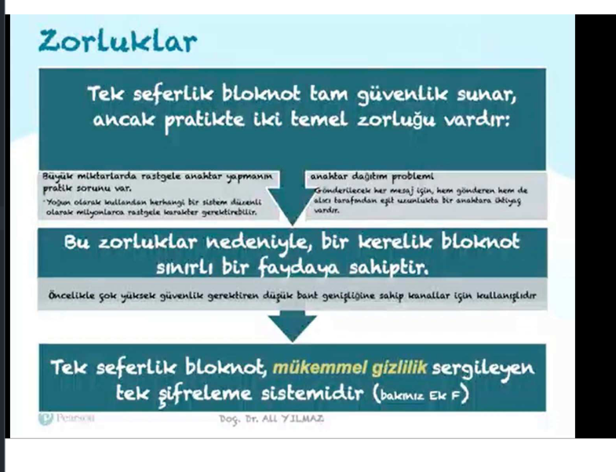

#### AES (Advanced Encryption Standard - Gelişmiş Şifreleme Standardı)

**AES**, günümüzde en yaygın kullanılan **simetrik anahtarlı blok şifreleme** algoritmasıdır. NIST (ABD Ulusal Standartlar ve Teknoloji Enstitüsü) tarafından DES'in yerine geçmesi için standart olarak kabul edilmiştir.

-   **Blok Boyutu**: 128 bit (sabit).
-   **Anahtar Uzunlukları**: 128, 192 veya 256 bit olabilir. Anahtar uzunluğuna göre tur sayısı değişir (10, 12 veya 14 tur).
-   **Yapı**: Feistel yapısı kullanmaz, bunun yerine **Yerine Koyma-Permütasyon Ağı (Substitution-Permutation Network - SPN)** kullanır.
-   **Güvenlik ve Hız**: Hem güvenli hem de yazılım ve donanımda hızlı çalışacak şekilde tasarlanmıştır.

AES algoritması, belirli bir sayıda **tur (round)** işlemi gerçekleştirir. Her tur genellikle şu adımları içerir:

1.  **SubBytes**: Doğrusal olmayan bir bayt yerine koyma işlemi (S-box kullanarak).
2.  **ShiftRows**: Satırların dairesel olarak kaydırılması.
3.  **MixColumns**: Sütunların karıştırılması (doğrusal bir dönüşüm).
4.  **AddRoundKey**: Tur anahtarının mevcut durumla XOR'lanması.

Son turda MixColumns adımı atlanır. Başlangıçta bir AddRoundKey adımı daha vardır. Anahtarlar, ana anahtardan **anahtar genişletme (key expansion)** algoritması ile türetilir.

AES algoritması, genellikle **ECB (Electronic Codebook)**, **CBC (Cipher Block Chaining)**, **CFB (Cipher Feedback)**, **OFB (Output Feedback)** ve **CTR (Counter)** gibi çalışma modları ile birlikte kullanılır. Bu modlar, şifreleme işleminin farklı güvenlik ve uygulama gereksinimlerini karşılamak için tasarlanmıştır (örn. ECB genellikle güvensiz kabul edilir, CBC ve CTR daha yaygındır).

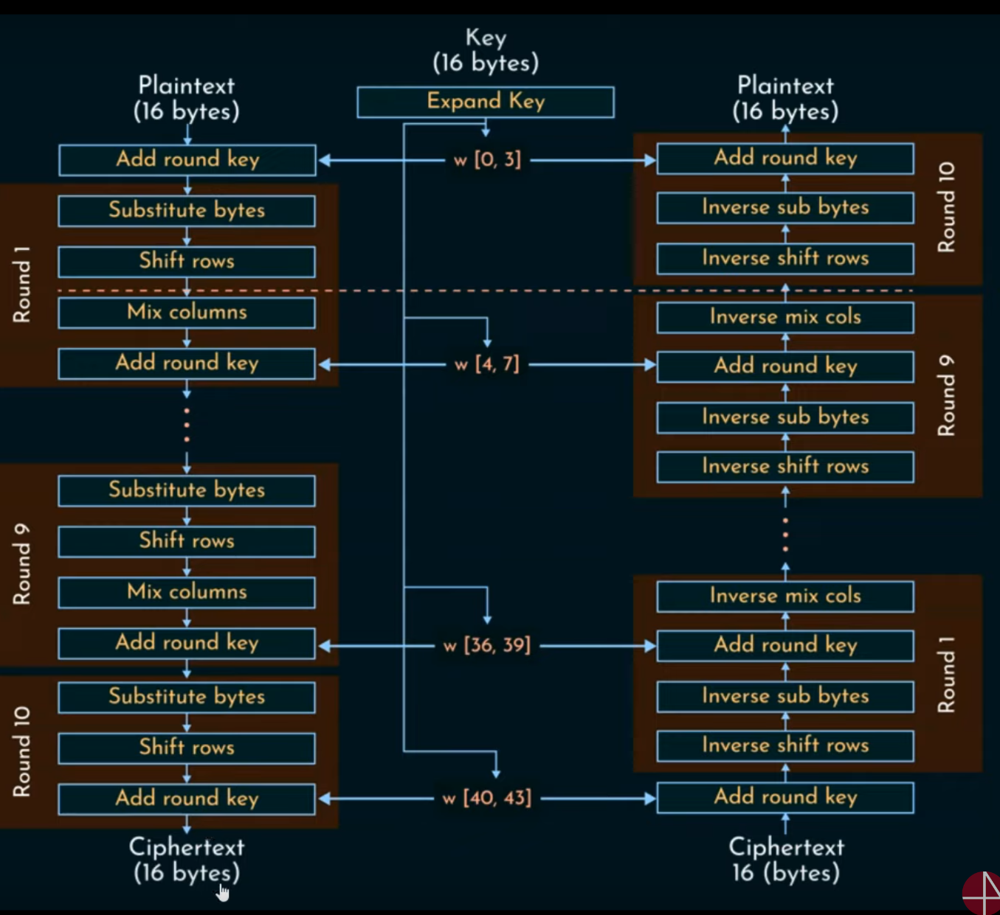

### Raylı Çit Şifrelemesi (Rail Fence Cipher)

Raylı Çit şifrelemesi, basit bir **transpozisyon (yer değiştirme)** şifreleme yöntemidir. Harflerin kendileri değiştirilmez, sadece sıraları değiştirilir.

Düz metin, belirli bir sayıda "ray" (satır) üzerine zikzak şeklinde yazılır ve ardından şifreli metin, raylar sırayla okunarak oluşturulur. Anahtar, kullanılan ray sayısıdır.

Örneğin, "meet me after the toga party" mesajını **derinlik 2** (2 ray) ile şifrelemek için:

1.  **Metni Raylara Zikzak Yerleştirme**:
    ```
    m . e . m . a . t . r . h . t . g . p . r . y
    . e . t . e . f . e . t . e . o . a . a . t .
    ```

2.  **Rayları Sırayla Okuma**:
    -   İlk ray: `mematrhtgpry`
    -   İkinci ray: `etefeteoaat`

3.  **Şifreli Metni Oluşturma**:
    -   Raylar sırayla birleştirilir: `MEMATRHTGPRYETEFETEOAAT`

Sonuç olarak, şifreli mesaj: `MEMATRHTGPRYETEFETEOAAT`

Bu yöntem de basit frekans analizine karşı bir miktar koruma sağlasa da, permütasyonları deneyerek veya digram/trigram analizleri ile kırılabilir.

### Sütunlu Transpozisyon (Columnar Transposition)

Sütunlu transpozisyon, başka bir transpozisyon şifreleme yöntemidir.

İleti, belirli sayıda sütuna sahip bir dikdörtgen içine satır satır yazılır. Şifreli metin, sütunlar belirli bir sıraya göre (anahtara göre) okunarak elde edilir. Anahtar, sütunların okunma sırasıdır.

#### Örnek

Düz Metin: "KRIPTOGRAFIYI SEVIYORUM" (23 harf)
Anahtar Kelime: "HACK" (4 harf) -> Sütun sırası: H=2, A=0, C=1, K=3 -> Okuma sırası: 2, 3, 1, 0 (Alfabetik sıraya göre: A, C, H, K -> Sütunlar: 1, 2, 0, 3)
*Düzeltme: Anahtar genellikle sütunların okunacağı sırayı doğrudan verir veya anahtar kelimenin harf sırası bu sırayı belirler. Örnekte anahtar [3, 1, 4, 2] verilmiş, bunu kullanalım.*

Anahtar: [3, 1, 4, 2] (4 sütun) -> Okuma sırası: Sütun 1, Sütun 3, Sütun 0, Sütun 2

1.  **Metni Dikdörtgen Halinde Yazma** (4 sütun, eksik yerler X ile doldurulur):
    ```
    Sütun 0  1  2  3
    -----------------
    K        R  İ  P
    T        O  G  R
    A        F  İ  Y
    İ        S  E  V
    İ        Y  O  R
    U        M  X  X
    ```

2.  **Sütunları Anahtara Göre Okuma** (Sıra: 1, 3, 0, 2):
    -   Sütun 1: R O F S Y M
    -   Sütun 3: P R Y V R X
    -   Sütun 0: K T A İ İ U
    -   Sütun 2: İ G İ E O X

3.  **Şifreli Metni Oluşturma**:
    Şifreli metin: "ROFSYMPRYVRXKTAIIUIGIEOX"

Bu yöntem, harf frekanslarını korur ancak harflerin yerlerini değiştirdiği için monoalfabetik şifrelemeden farklıdır. Kriptanalizi daha karmaşıktır ancak imkansız değildir.

### Özet (Bölüm 3)

-   Simetrik kriptografinin ana kavramlarına genel bir bakış sunduk (aynı anahtar kullanılır).
-   Kriptanaliz (şifreyi kırma bilimi) ve kaba kuvvet saldırısı (tüm anahtarları deneme) arasındaki farkı açıkladık.
-   Monoalfabetik bir ikame şifresinin (örn. Sezar, basit ikame) gelişimini ve zayıflıklarını (frekans analizi) anladık.
-   Polialfabetik bir şifrenin (örn. Vigenère, Playfair, Hill) gelişimini ve monoalfabetik şifrelere göre avantajlarını anladık.
-   Hill şifresine (lineer cebir tabanlı poligrafik şifre) genel bir bakış sunduk.
-   Transpozisyon şifrelerine (örn. Raylı Çit, Sütunlu Transpozisyon) değindik.

***endofchapter3***

### Akış Şifresi vs Blok Şifresi

#### Akış Şifresi

Dijital veri akışı her seferinde **bir bit** veya **bir bayt** olarak şifrelenir.

##### Örnekler:

-   Otomatik anahtarlı Vigenère şifresi (anahtar metinden türetilir)
-   Vernam şifresi (OTP prensibi)
-   RC4, ChaCha20 gibi modern akış şifreleri

##### İdeal Durum (OTP):

-   İdeal bir senaryoda, Vernam şifresinin tek seferlik bir bloknot (One-Time Pad) versiyonu kullanılmalıdır. Bu durumda, anahtar akışı düz metin bit akışı kadar uzun ve tamamen rastgele olmalıdır.
-   Eğer kriptografik anahtar akışı tamamen rastgele ise, bu şifre, anahtar akışını ele geçirmek dışında herhangi bir yöntemle kırılamaz.

##### Anahtar Akışı Üretimi:

-   Pratikte OTP'nin anahtar dağıtım zorluğu nedeniyle, anahtar akışı genellikle **sözde rastgele bir sayı üreteci (PRNG - Pseudorandom Number Generator)** kullanılarak kısa bir **başlangıç anahtarından (seed)** türetilir.
-   Bu PRNG'nin ürettiği anahtar akışının istatistiksel olarak rastgele görünmesi ve tahmin edilemez olması (kriptografik olarak güvenli olması) gerekir.
-   Anahtar akışının önceki bölümlerine dayanarak gelecek bölümlerini tahmin etmek hesaplama açısından pratik olmamalıdır.
-   İki kullanıcının yalnızca başlangıç anahtarını güvenli bir şekilde paylaşması gerekir ve her ikisi de aynı anahtar akışını üretebilir.

#### Blok Şifreleme

-   Bir düz metin bloğu (genellikle 64 veya 128 bit) bir bütün olarak ele alınır ve eşit uzunlukta bir şifreli metin bloğu üretmek için kullanılır.
-   Tipik olarak 64 (DES, 3DES) veya 128 bitlik (AES) bir blok boyutu kullanılır.
-   Bir akış şifresinde olduğu gibi, iki kullanıcı simetrik bir şifreleme anahtarını paylaşır.
-   Ağ tabanlı simetrik kriptografi uygulamalarının çoğu (örn. TLS/SSL, IPsec) blok şifrelerden yararlanır (uygun çalışma modları ile).

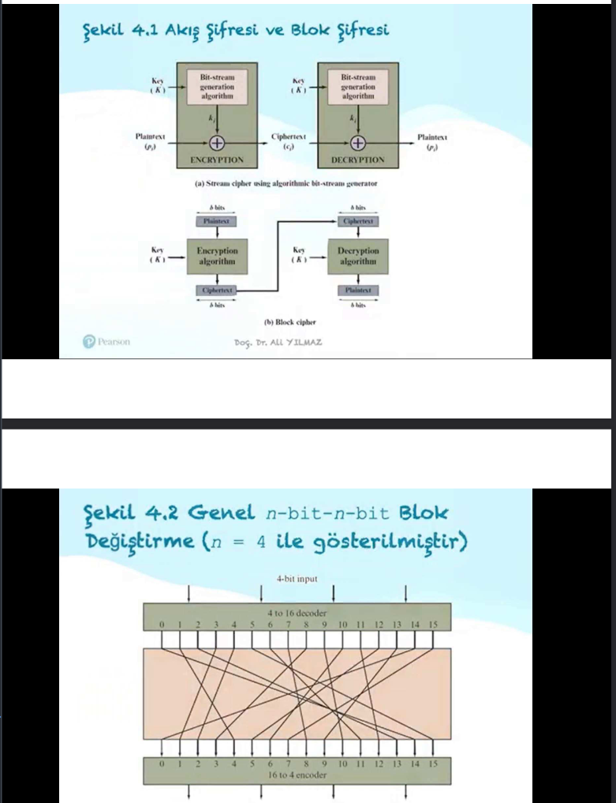

### Feistel Şifreleme Yapısı

Feistel şifreleme, birçok simetrik blok şifreleme algoritmasının (örn. DES) temelini oluşturan genel bir yapıdır. Bu yapı, şifreleme ve şifre çözme işlemlerinin çok benzer olmasını sağlar.

Feistel yapısı, şifrelenecek bloğu iki yarıya (L ve R) böler ve belirli sayıda tur (round) uygular. Her turda:

1.  Sağ yarı (Rᵢ₋₁), bir **tur fonksiyonu (F)**'na girer. Bu fonksiyon, sağ yarıyı ve o tura ait **alt anahtarı (Kᵢ)** kullanarak bir çıktı üretir.
2.  Tur fonksiyonunun çıktısı, sol yarı (Lᵢ₋₁) ile **XOR**'lanır. Bu sonuç yeni sağ yarı (Rᵢ) olur.
3.  Eski sağ yarı (Rᵢ₋₁), yeni sol yarı (Lᵢ) olur.

Matematiksel olarak:
Lᵢ = Rᵢ₋₁
Rᵢ = Lᵢ₋₁ ⊕ F(Rᵢ₋₁, Kᵢ)

Şifre çözme işlemi, aynı alt anahtarları ters sırada kullanarak aynı yapı ile gerçekleştirilir.

Feistel, ikameleri (substitution) ve permütasyonları (transposition/permutation) birleştiren bir **çarpım şifresi (product cipher)** kullanılmasını önermiştir:

-   **Yerine Koyma (Substitution)**: Her düz metin öğesi veya öğe grubu, karşılık gelen bir şifreli metin öğesi veya öğe grubuyla benzersiz bir şekilde değiştirilir (örn. S-box'lar). Bu **karışıklık (confusion)** sağlar.
-   **Permütasyon (Permutation/Transposition)**: Öğelerin dizide görünme sırası değiştirilir (örn. P-box'lar). Bu **yayılma (diffusion)** sağlar.

Feistel yapısı, Claude Shannon'un **karışıklık (confusion)** ve **yayılma (diffusion)** kavramlarının pratik bir uygulamasıdır.

### Difüzyon ve Karışıklık (Diffusion and Confusion)

Claude Shannon tarafından bir şifreleme sisteminin güvenliğini değerlendirmek için sunulan iki temel kavramdır. Amaç, istatistiksel analize dayalı kriptanalizi engellemektir.

-   **Yayılma (Diffusion)**: Düz metnin istatistiksel yapısının şifreli metne yayılmasıdır. Yani, düz metindeki tek bir bitin değiştirilmesi, şifreli metindeki birçok bitin değişmesine neden olmalıdır (ideal olarak yaklaşık yarısının). Bu, düz metin ve şifreli metin arasındaki istatistiksel ilişkileri gizler. Permütasyon (P-box) adımları genellikle yayılmayı artırır.
-   **Karışıklık (Confusion)**: Şifreli metin ile anahtar arasındaki ilişkinin mümkün olduğunca karmaşık hale getirilmesidir. Saldırgan şifreli metnin istatistiklerini bilse bile, anahtarı çıkarması zor olmalıdır. Yerine koyma (S-box) adımları genellikle karışıklığı artırır ve doğrusal olmayan bir yapı sağlar.

Bu iki kavram, modern blok şifrelerin tasarımında temel hedeflerdir.

### Feistel Şifre Tasarım Özellikleri

-   **Blok Boyutu**: Daha büyük blok boyutu daha fazla güvenlik sağlar ancak şifreleme hızını düşürebilir. 64 bit makul bir dengeydi, günümüzde 128 bit (AES) standarttır.
-   **Anahtar Boyutu**: Daha büyük anahtar boyutu kaba kuvvet saldırılarına karşı daha fazla güvenlik sağlar. 56 bit (DES) artık yetersizdir, 128 bit ve üzeri (AES) güvenli kabul edilir.
-   **Tur Sayısı**: En kritik tasarım seçeneğidir. Daha fazla tur sayısı genellikle kriptanalize karşı daha fazla direnç anlamına gelir, ancak performansı düşürür. Tur sayısı, bilinen saldırıların kaba kuvvetten daha zor olmasını sağlayacak şekilde seçilmelidir.
-   **Alt Anahtar Üretme Algoritması**: Ana anahtardan her tur için alt anahtarları türetir. Karmaşık olmalı ve alt anahtarlar arasında veya alt anahtarlarla ana anahtar arasında kolayca ilişki kurulmasını engellemelidir.
-   **Tur Fonksiyonu (F)**: Feistel yapısının kalbidir. Ne kadar **doğrusal olmayan (nonlinear)** olursa, diferansiyel ve lineer kriptanaliz gibi saldırılara karşı o kadar dirençli olur. S-box'lar bu doğrusal olmayanlığı sağlar.
-   **Hız ve Yazılım/Donanım Performansı**: Algoritmanın hem yazılımda hem de donanımda verimli çalışması önemlidir.
-   **Analiz Kolaylığı**: Algoritmanın tasarımı basit ve anlaşılır olmalıdır ki güvenlik açıkları daha kolay analiz edilebilsin ve güvenilirliği konusunda daha yüksek bir güvence oluşsun. (Ancak bu, saldırganın işini kolaylaştırmamalıdır.)

#### DES (Data Encryption Standard - Veri Şifreleme Standardı)

[Referans](https://www.tutorialspoint.com/cryptography/data_encryption_standard.htm) *(Not: Referans linki değiştirildi, önceki link rainbow table saldırısı ile ilgiliydi)*

**Veri Şifreleme Standardı (DES)**, NIST tarafından yayınlanan **simetrik anahtarlı bir blok şifrelemedir**. Uzun yıllar standart olarak kullanılmıştır ancak anahtar boyutunun (56 bit) günümüz işlem gücüyle kaba kuvvet saldırılarına karşı yetersiz kalması nedeniyle artık güvenli kabul edilmemektedir (yerine AES geçmiştir).

DES, bir **Feistel Şifrelemesi** uygulamasıdır:

-   **Blok Boyutu**: 64 bit.
-   **Anahtar Boyutu**: 64 bit (ancak 8 bit parity biti olarak kullanılır, **etkin anahtar uzunluğu 56 bittir**).
-   **Tur Sayısı**: 16 tur.
-   **Yapı**: Klasik Feistel yapısı.

DES'in temel bileşenleri:

-   **Başlangıç ve Son Permütasyonlar (IP ve FP⁻¹)**: Bloktaki bitlerin yerini değiştiren sabit permütasyonlardır (P-kutuları). Birbirlerinin tersidirler ve kriptografik olarak önemli bir katkıları yoktur (muhtemelen 1970'lerde donanım yüklemesini kolaylaştırmak için eklenmişlerdir).
-   **Tur Fonksiyonu (f)**: DES'in kalbidir. 32 bitlik sağ yarıyı ve 48 bitlik tur anahtarını girdi olarak alır, 32 bitlik bir çıktı üretir.
    -   **Genişleme Permütasyonu (E-box)**: 32 bitlik sağ yarıyı 48 bite genişletir (bazı bitleri tekrarlayarak). Bu, **yayılma (diffusion)** sağlar.
    -   **XOR (Anahtar Karıştırma)**: Genişletilmiş 48 bitlik yarı, 48 bitlik tur anahtarı ile XOR'lanır.
    -   **Yerine Koyma Kutuları (S-box)**: XOR sonucundaki 48 bit, 8 adet 6-bitlik gruba ayrılır. Her grup, kendine özel bir S-box'a girer. Her S-box, 6 bitlik girdiyi 4 bitlik bir çıktıya dönüştürür. S-box'lar DES'in **doğrusal olmayan (nonlinear)** tek bileşenidir ve **karışıklık (confusion)** sağlarlar. DES'in güvenliği büyük ölçüde S-box'ların tasarımına dayanır.
    -   **Düz Permütasyon (P-box)**: 8 S-box'tan çıkan 32 bitlik çıktı, sabit bir permütasyondan (P-box) geçirilir. Bu da **yayılma (diffusion)** sağlar.
-   **Anahtar Zamanlama (Key Schedule)**: 56 bitlik etkin anahtardan 16 adet 48 bitlik tur anahtarını üretir. Bu işlem, anahtar bitlerinin permütasyonları ve dairesel kaydırmalarını içerir.

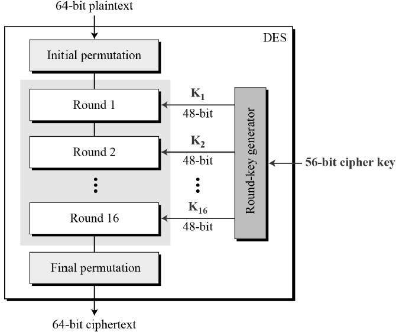
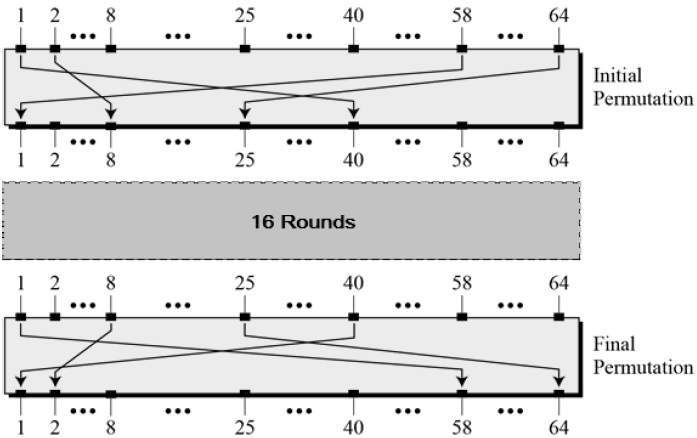
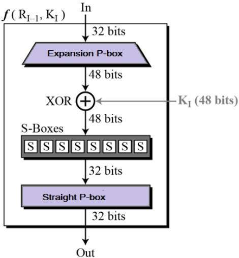
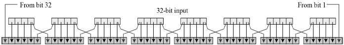
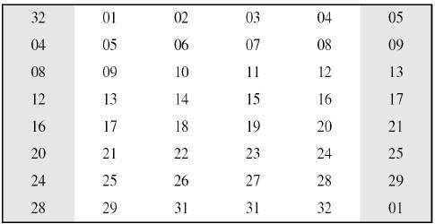
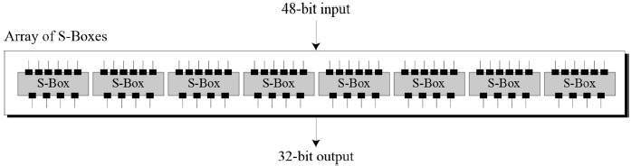
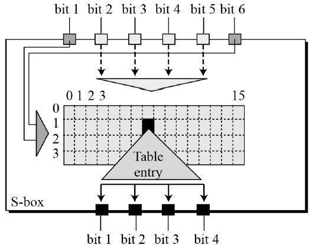
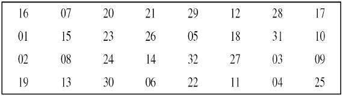
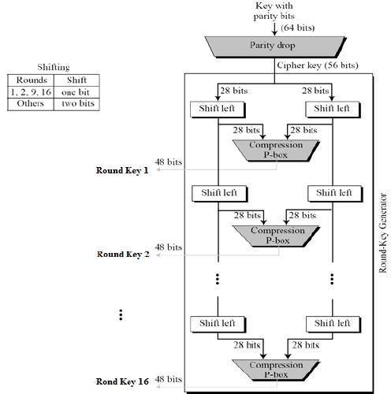

**DES Analizi**

DES, blok şifrelerin istenen iki temel özelliğini (Shannon'un kavramları) iyi bir şekilde karşılar:

-   **Çığ Etkisi (Avalanche Effect)**: Düz metin veya anahtardaki küçük bir değişiklik (örn. tek bir bit), şifreli metinde çok büyük bir değişikliğe (ortalama olarak bitlerin yarısının değişmesi) neden olur. Bu, **yayılma** ve **karışıklığın** bir sonucudur.
-   **Tamlık (Completeness)**: Şifreli metindeki her bit, düz metin ve anahtardaki birçok bite bağlıdır.

Kriptanalistler, özellikle **zayıf anahtarlar (weak keys)** ve **yarı zayıf anahtarlar (semi-weak keys)** olarak bilinen bazı anahtar değerlerinde DES'in zayıflıklarını bulmuşlardır. Bu anahtarlar, alt anahtar üretim sürecindeki simetriler nedeniyle sorun yaratır ve kullanılmamalıdır.

DES, tasarlandığı dönem için çok iyi bir blok şifreydi. **Kapsamlı anahtar araması (exhaustive key search / brute-force)** dışında, **diferansiyel kriptanaliz** ve **lineer kriptanaliz** gibi daha gelişmiş saldırılar bulunsa da, bunlar tam 16 tur DES'i kaba kuvvetten önemli ölçüde daha hızlı kırmak için genellikle pratik değildir (ancak tur sayısı azaltılmış versiyonları kırabilirler). DES'in asıl zayıflığı, 56 bitlik anahtar boyutunun günümüzdeki işlem gücüyle kaba kuvvet saldırılarına karşı savunmasız olmasıdır. (Triple DES veya 3DES, DES'i üç kez farklı anahtarlarla uygulayarak bu sorunu çözmeye çalışır ancak daha yavaştır ve başka zayıflıkları vardır.)

### Saldırı Türleri ve Kriptoanaliz

Kriptanalizcinin sahip olduğu bilgi ve yeteneklere göre saldırılar sınıflandırılır:

#### 1.  **Yalnızca Şifreli Metin Saldırısı (Ciphertext-Only Attack - COA)**
    -   Saldırganın elinde sadece bir veya daha fazla şifreli metin bulunur.
    -   Şifreleme algoritmasını bildiği varsayılır.
    -   En zor saldırı türüdür, çünkü en az bilgiye dayanır. Amaç genellikle anahtarı veya düz metni bulmaktır.

#### 2.  **Bilinen Düz Metin Saldırısı (Known-Plaintext Attack - KPA)**
    -   Saldırgan, şifreleme algoritmasını bilir ve en az bir düz metin-şifreli metin çiftine sahiptir.
    -   Amaç, bu bilgiyi kullanarak anahtarı veya aynı anahtarla şifrelenmiş diğer şifreli metinleri çözmektir.

#### 3.  **Seçilen Düz Metin Saldırısı (Chosen-Plaintext Attack - CPA)**
    -   Saldırgan, şifreleme algoritmasını bilir ve geçici bir süre için şifreleme makinesine erişimi vardır.
    -   Kendi seçtiği düz metinleri şifreleyebilir ve karşılık gelen şifreli metinleri elde edebilir.
    -   Amaç, bu çiftleri analiz ederek anahtarı bulmaktır. Diferansiyel kriptanaliz bu tür bir saldırıdır.

#### 4.  **Seçilen Şifreli Metin Saldırısı (Chosen-Ciphertext Attack - CCA)**
    -   Saldırgan, şifreleme algoritmasını bilir ve geçici bir süre için şifre çözme makinesine erişimi vardır.
    -   Kendi seçtiği şifreli metinleri (saldırının hedefi olan şifreli metin hariç) çözdürebilir ve karşılık gelen düz metinleri elde edebilir.
    -   Amaç, bu bilgiyi kullanarak anahtarı veya hedef şifreli metnin düz metnini bulmaktır. Lineer kriptanaliz bu tür bir saldırı olabilir.

#### 5.  **Seçilen Metin Saldırısı (Chosen-Text Attack)**
    -   Genellikle CPA ve CCA'nın birleşimi olarak düşünülür. Saldırgan hem seçtiği düz metinleri şifreletebilir hem de seçtiği şifreli metinleri çözdürebilir.

#### 6.  **İlişkili Anahtar Saldırısı (Related-Key Attack)**
    -   Saldırgan, farklı ancak matematiksel olarak ilişkili (örn. sadece birkaç biti farklı) anahtarlarla şifrelenmiş metinlere erişebilir. Amaç, bu ilişkiden yararlanarak anahtarları bulmaktır.

### DES'in Gücü ve Zamanlama Saldırıları

-   **Zamanlama Saldırıları (Timing Attacks)**:
    -   Bir şifreleme veya şifre çözme işleminin ne kadar sürdüğünü ölçerek anahtar veya düz metin hakkında bilgi sızdırmaya çalışan bir **yan kanal saldırısı (side-channel attack)** türüdür.
    -   Algoritmanın farklı girdiler (farklı anahtar bitleri veya veri bitleri) için biraz farklı sürelerde çalışması gerçeğinden yararlanır (örn. işlemci önbelleği etkileşimleri, koşullu dallanmalar).
    -   DES ve AES gibi modern simetrik şifrelerin dikkatli uygulamaları genellikle zamanlama saldırılarına karşı dirençli olacak şekilde tasarlanır (örn. sabit zamanlı operasyonlar kullanarak), ancak dikkatsiz uygulamalar savunmasız olabilir.
    -   Asimetrik algoritmalarda (örn. RSA) daha büyük bir tehdit oluşturabilirler.

### Blok Şifre Tasarım İlkeleri: Tur Sayısı

-   Tur sayısı arttıkça, kriptanaliz yapmak (özellikle diferansiyel ve lineer kriptanaliz gibi istatistiksel saldırılar) daha zor hale gelir. Çünkü her tur, **yayılma** ve **karışıklığı** artırarak düz metin/anahtar ile şifreli metin arasındaki istatistiksel ilişkileri zayıflatır.
-   Genel bir kriter olarak, tur sayısı, bilinen en iyi kriptanalitik saldırının maliyetini (gerekli veri ve hesaplama miktarı) basit bir **kaba kuvvet anahtar arama saldırısından** daha fazla yapacak şekilde belirlenmelidir.
-   Örneğin, DES'in 15 veya daha az turu olsaydı, diferansiyel kriptanaliz, 56 bitlik anahtar uzayında kaba kuvvet aramasından daha az çaba gerektirirdi. 16 tur, bu saldırıya karşı bir güvenlik marjı sağlamıştır (ancak anahtar boyutu hala yetersizdir).

### Blok Şifre Tasarım İlkeleri: F Fonksiyonunun Tasarımı (Feistel için) / Tur Dönüşümü (SPN için)

-   Feistel blok şifresinin temel bileşeni **F fonksiyonudur**. SPN ağlarında ise **tur dönüşümünün** tamamıdır (örn. AES'teki SubBytes, ShiftRows, MixColumns).
-   Bu fonksiyonların **doğrusal olmayan (nonlinear)** yapısı kritiktir. F fonksiyonu ne kadar doğrusal olmayan bir yapıya sahipse, lineer ve diferansiyel kriptanaliz gibi saldırılar o kadar zorlaşır. S-box'lar genellikle bu doğrusal olmayanlığı sağlar.
-   **SAC (Strict Avalanche Criterion - Sıkı Çığ Kriteri)** ve **BIC (Bit Independence Criterion - Bit Bağımsızlık Kriteri)** gibi kriterler, F fonksiyonunun (veya S-box'ların) iyi bir **yayılma** ve **karışıklık** sağladığını ölçmek için kullanılır.
    -   **SAC**: Girdideki tek bir bitin değiştirilmesi, çıktıdaki her bitin %50 olasılıkla değişmesine neden olmalıdır.
    -   **BIC**: Girdideki herhangi bir bit değiştirildiğinde, çıktı bitlerindeki değişiklikler birbirinden bağımsız olmalıdır.

### Blok Şifre Tasarım İlkeleri: Anahtar Zamanlama Algoritması

-   Anahtar zamanlama algoritması, ana anahtardan her tur için **alt anahtarları (round keys)** üretir.
-   Bu algoritma da güvenlik açısından kritiktir:
    -   Alt anahtarlar arasında veya alt anahtarlarla ana anahtar arasında kolayca bir ilişki kurulabilmesi (örn. lineer ilişkiler) saldırılara yol açabilir (**ilişkili anahtar saldırıları** gibi).
    -   Alt anahtarların tek tek çıkarılması ve buradan ana anahtara geri dönülmesi zor olmalıdır.
    -   Anahtar zamanlama algoritmasının kendisinin de iyi **yayılma** ve **karışıklık** özelliklerine sahip olması, örneğin anahtardaki küçük değişikliklerin alt anahtarlarda büyük değişikliklere yol açması istenir. **SAC** ve **BIC** gibi kriterler anahtar zamanlama algoritması için de değerlendirilebilir.

### Özet (Bölüm 4)

-   **Çığ etkisi** kavramını açıkladık (girdi değişikliğinin çıktıda büyük etki yaratması).
-   DES'in şifreleme yapısını (Feistel, tur fonksiyonu, S-box, P-box, anahtar zamanlama) ve çıktı özelliklerini tartıştık.
-   Temel blok şifre tasarım ilkelerini (blok boyutu, anahtar boyutu, tur sayısı, F fonksiyonu/tur dönüşümü, anahtar zamanlama, yayılma, karışıklık) özetledik.
-   **Akış şifreleri** (bit/bayt bazında, PRNG ile anahtar akışı) ve **blok şifreler** (sabit bloklar halinde) arasındaki ayrımı anladık.
-   **Feistel şifre yapısına** genel bir bakış sunduk ve şifre çözmenin şifrelemenin tersi olduğunu (aynı algoritma, ters anahtar sırası) açıkladık.
-   **Veri Şifreleme Standardı'na (DES)** genel bir bakış sunduk.
-   Farklı **kriptanaliz saldırı türlerini** (COA, KPA, CPA, CCA) tanımladık.
-   **Zamanlama saldırılarına** değindik.

***endofchapter4***