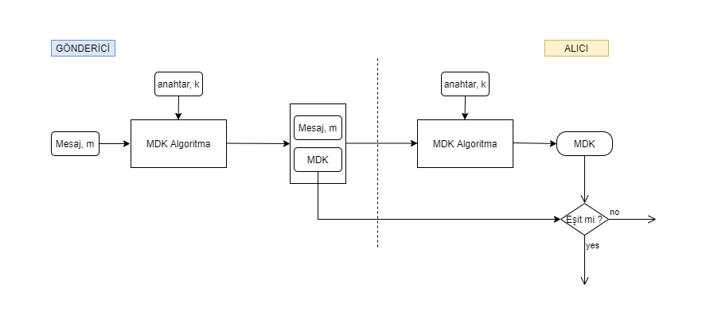
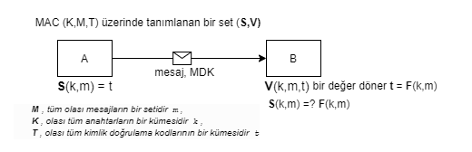
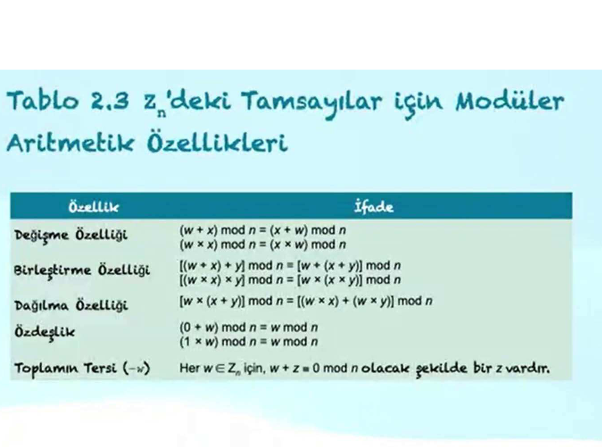

- **Pasif Saldırı**: Sistemdeki bilgileri öğrenmeye veya kullanmaya çalışır, ancak sistem kaynaklarını etkilemez.
- **Aktif Saldırı**: Sistem kaynaklarını değiştirmeye veya operasyonlarını etkilemeye çalışır.

- X.800'de iki özel kimlik doğrulama hizmeti vardır:
  - Eş varlık kimlik doğrulaması
  - Veri kaynağı kimlik doğrulaması

Geri dönüşümlü bir şifreleme mekanizması, verilerin şifrelenmesini ve daha sonra şifrelerinin çözülmesini sağlayan bir şifreleme algoritmasıdır.

- Geri dönüşümsüz şifreleme mekanizmaları, dijital imza ve ileti kimlik doğrulama uygulamalarında kullanılan karma algoritmaları ve ileti kimlik doğrulama kodlarını içerir.


A cryptographic hash function (CHF) is a hash algorithm (a map of an arbitrary binary string to a binary string with a fixed size of n bits) that has special properties desirable for a cryptographic application. A cryptographic hash function is a one-way function, meaning that it is computationally infeasible to invert the function and recover the original input from the output. The output of a cryptographic hash function is called a hash value or hash code. Cryptographic hash functions are used in various applications, including digital signatures, message authentication codes, and password hashing.

Kriptografik bir karma işlevi (CHF), bir hash algoritmasıdır (keyfi bir ikili diziyi sabit boyutlu bir n bitlik ikili diziye eşleyen bir harita) ve kriptografik uygulamalar için özel olarak arzu edilen özelliklere sahiptir. Kriptografik bir karma işlevi, tek yönlü bir işlevdir, yani işlevi tersine çevirmek ve çıktıyı kullanarak orijinal girdiyi kurtarmak hesaplama açısından uygulanamaz. Kriptografik bir karma işlevinin çıktısına karma değeri veya karma kodu denir. Kriptografik karma işlevleri, dijital imzalar, ileti kimlik doğrulama kodları ve parola karma işlemleri gibi çeşitli uygulamalarda kullanılır.


**_ai_**

### Kriptografik Hash Fonksiyonları

Kriptografik bir hash fonksiyonu (CHF), keyfi uzunluktaki bir ikili diziyi sabit uzunlukta bir n-bitlik ikili diziye eşleyen bir algoritmadır. Bu fonksiyonlar, kriptografik uygulamalar için özel olarak tasarlanmış ve aşağıdaki özelliklere sahiptir:

1. **Tek Yönlü İşlev**: Fonksiyonun çıktısından girdiyi hesaplama açısından geri elde etmek mümkün değildir.
2. **Çarpışma Direnci**: Farklı iki girdinin aynı hash değerini üretmesi olasılığı düşüktür.
3. **Hızlı Hesaplama**: Girdi verisinin hash değerini hızlı bir şekilde hesaplayabilir.

Kriptografik hash fonksiyonları, dijital imzalar, mesaj kimlik doğrulama kodları (MAC) ve parola saklama gibi birçok alanda kullanılır.

#### Örnek Python Kodu

Aşağıda, Python'da SHA-256 algoritmasını kullanarak bir metnin hash değerini hesaplayan bir örnek verilmiştir:

```python
import hashlib

def calculate_sha256_hash(data):
        # SHA-256 hash hesaplama
        sha256_hash = hashlib.sha256(data.encode()).hexdigest()
        return sha256_hash

# Örnek kullanım
text = "Merhaba Dünya"
hash_value = calculate_sha256_hash(text)
print(f"'{text}' metninin SHA-256 hash değeri: {hash_value}")
```

Bu kod, verilen bir metni SHA-256 algoritması ile hashleyerek çıktı olarak hash değerini döndürür.

### Tek Anahtarlı Algoritmalar

Tek anahtarlı algoritmalar, şifreleme ve şifre çözme işlemleri için aynı anahtarın kullanıldığı algoritmalardır. Bu tür algoritmalar, genellikle simetrik şifreleme olarak adlandırılır. Tek anahtarlı algoritmaların temel özellikleri şunlardır:

1. **Anahtar Yönetimi**: Anahtarın güvenli bir şekilde paylaşılması ve saklanması gerekmektedir.
2. **Hız**: Genellikle daha hızlıdırlar ve büyük veri setlerini işlemek için uygundur.
3. **Güvenlik**: Anahtarın gizliliği, sistemin güvenliğini doğrudan etkiler. Anahtarın ele geçirilmesi durumunda, şifreli verilerin güvenliği tehlikeye girebilir.

**_endofai_**

**_wiki_**

In cryptography, a block cipher is a deterministic algorithm that operates on fixed-length groups of bits, called blocks. Block ciphers are the elementary building blocks of many cryptographic protocols. They are ubiquitous in the storage and exchange of data, where such data is secured and authenticated via encryption.

A block cipher uses blocks as an unvarying transformation. Even a secure block cipher is suitable for the encryption of only a single block of data at a time, using a fixed key. A multitude of modes of operation have been designed to allow their repeated use in a secure way to achieve the security goals of confidentiality and authenticity. However, block ciphers may also feature as building blocks in other cryptographic protocols, such as universal hash functions and pseudorandom number generators.

Kriptografide, blok şifreleyici (block cipher), sabit uzunlukta bit grupları (bloklar) üzerinde çalışan deterministik bir algoritmadır. Blok şifreleyiciler, birçok kriptografik protokolün temel yapı taşlarıdır. Verilerin saklanması ve iletilmesinde yaygın olarak kullanılırlar; bu veriler şifreleme yoluyla güvence altına alınır ve doğrulanır.

Bir blok şifreleyici, bloklar üzerinde değişmeyen bir dönüşüm uygular. Güvenli bir blok şifreleyici bile yalnızca sabit bir anahtar kullanarak tek bir veri bloğunu şifrelemek için uygundur. Gizlilik ve bütünlük hedeflerine ulaşmak için tekrar tekrar kullanılabilmelerini sağlayan birçok çalışma modu tasarlanmıştır. Ancak blok şifreleyiciler, evrensel özetleme fonksiyonları ve sözde rastgele sayı üreticileri gibi diğer kriptografik protokollerde de yapı taşı olarak kullanılabilir.


**\*endofwiki**

#### 🔐 Deterministik ve Deterministik Olmayan Algoritmalar

Kriptografi bağlamında algoritmalar genellikle **deterministik** ya da **deterministik olmayan (non-deterministic)** olarak sınıflandırılır.

---

##### ✅ Deterministik Algoritma Nedir?

Deterministik bir algoritma, **aynı girdiye her zaman aynı çıktıyı** verir. Bu algoritmalar rastgelelik içermez.

##### 📌 Özellikleri:

- Tahmin edilebilir.
- Test edilmesi ve hata ayıklanması kolaydır.
- Şifreleme algoritmalarının bazı yönleri (örneğin AES bloğu) deterministiktir.

💡 Örnek:
AES ile ECB modunda bir blok şifreleme:

```plaintext
Girdi: "merhaba123"
Anahtar: "gizli_anahtar"
→ Şifreli çıktı: "XJ38SAB998ZZ"

Tekrar aynı girdiyi verirsek:
Girdi: "merhaba123"
Anahtar: "gizli_anahtar"
→ Şifreli çıktı: yine "XJ38SAB998ZZ"
```

---

##### ❎ Deterministik Olmayan (Non-Deterministic) Algoritma Nedir?

Aynı girdiye farklı zamanlarda farklı çıktılar verebilen, rastgelelik içeren algoritmalardır.

##### 📌 Özellikleri:

- Güvenliği artırır (örneğin tekrar eden verileri gizlemek için).
- Doğrulama işlemleri daha karmaşık olabilir.
- Rastgele sayı üreten algoritmalar veya IV (Initialization Vector) kullanan şifreleme modları örnektir.

💡 Örnek:
AES ile CBC modunda blok şifreleme (IV ile):

```plaintext
Girdi: "merhaba123"
Anahtar: "gizli_anahtar"
IV: rastgele
→ Şifreli çıktı: "7AS2KLZ188"

Aynı girdiyi tekrar verirsek:
Yeni IV: farklı rastgele değer
```

---

#### 🔄 Karşılaştırma Tablosu

| **Özellik**            | **Deterministik Algoritma**  | **Non-Deterministik Algoritma** |
| ---------------------- | ---------------------------- | ------------------------------- |
| Girdi tekrarında çıktı | Aynı                         | Farklı olabilir                 |
| Rastgelelik            | Yok                          | Var                             |
| Kriptografik kullanım  | Hash fonksiyonları, ECB modu | CBC modu, IV kullanımı          |
| Doğrulama kolaylığı    | Kolay                        | Zor                             |

---

#### 📌 Sonuç

- Deterministik algoritmalar sistematik ve öngörülebilirdir.
- Non-deterministik algoritmalar ise güvenlik açısından daha güçlüdür ancak kontrol edilmesi daha zordur.

### AKış Şifreleme

Bu şifrelemedeki amaç yöntem olarak bir akışı kullanmaktır. Yani her şifreleme birimindeki işlem bir önceki şifreleme işlemine bağlıdır. Örneğin her harfin şifrelenmesi sırasında bir önceki şifrelemeden çıkan bilgi anahtar olarak kullanılabilir. Veya anahtar kendi içerisinde çeşitli formüllere tabi tutularak bir sonraki anahtar bilgilerini üretebilir.

Mesaj Doğrulama Kodu (Message Authentication Code) kriptografi biliminde mesajın bütünlüğünü teyit etmek için mesaja eklenen bir kaç baytlık veri kümesidir. Genellikle MAC (MDK) olarak adlandırılır ve kriptografik özet fonksiyon olarak da bilinir. Private Key (Özel/Gizli anahtar) ile birlikte MDK algoritması kullanılarak bir özet çıktı elde edilir. Bu özet çıktıya Mesaj Doğrulama Kodu denir. Böylelikle alıcı tarafta gizli anahtara sahip olan kişi mesajın doğruluğunu kontrol edebilir.

Gönderici, MDK oluşturmak için Private Key ile MDK algoritması kullanarak elde ettiği özeti, mesajla alıcı tarafına gönderir. Alıcı, kendisine gelen bu mesajı sadece kendisinde ve göndericide olan bu özel anahtar MDK algoritmasıyla tekrar bir özet değer üretir. Oluşan bu özet, yani Mesaj Doğrulama Kodu gönderici tarafından mesaja eklenerek gelen MDK ile karşılaştırılır. Eğer bu özet değerler birbirine eşitse mesaj bütünlüğü korunmuş olur. Şayet bu özet değerler birbirine uyuşmazsa mesaj içeriğinin değiştirildiğini ve bütünlüğünün korunmadığı anlamına gelir. Bir diyagram ile özetlersek;




Bu yöntemin birincil dezavantajı, mesajı değişikliklere karşı koruma eksikliğidir. MDK' lar mesajın bütünlüğünü doğrularken mesajın gizliliğini sağlamada yetersizdir. Çünkü saldıran kişi özel anahtarı elde etse ve istediği mesajları bu anahtarı kullanarak elde edebilir. Burada saldırgan MDK'yı üreten algoritmayı özel anahtar ile geri elde etmeye çalışırken başka mesajlara karşılık gelen MDK'yı olası bir zaman içerisinde elde edememelidir.

MDK'ları, dijital imzadan ayıran en belirgin özelliklerden biri üretme ve doğrulama tarafını tek bir anahtar ile yaparken dijital imza public key (genel anahtar) ve private key (özel anahtar) olarak 2 anahtar kullanır. MDK'yı oluşturmak ve doğrulamak DES'e (Data Encryption Standart) dayanır yani simetrik şifreleme yapasına sahiptir. Dijital imza ise asimetrik bir yapıya sahiptir. Dijital imzadaki genel ve özel anahtar birbiriyle matematiksel olarak bağlantılıdır ama genel anahtardan özel anahtara ulaşılamaz. Bu özellik mesajın kim tarafından oluşturulduğunu ve kime ait olduğunu kanıtladığından dolayı mesaj bütünlüğünün yanında kimliğin inkar edilemezliliğini sağlar. MDK'lar bu inkar edilemezliği sağlayamadığından ötürü dijital imzalardan ayrılan bir diğer özelliktir.

### Asimetrik Algoritmalar

    Tek bir anahtar ile şifreleme ve şifre çözme işlemi yapılmaz. Her iki işlem için farklı anahtarlar kullanılır. Bu anahtarlara genel anahtar (public key) ve özel anahtar (private key) denir. Genel anahtar herkesle paylaşılabilirken, özel anahtar sadece sahibinde bulunur. Genel anahtar ile şifrelenmiş bir mesaj sadece o mesajın özel anahtarı ile çözülebilir. Bu özellik, asimetrik algoritmaların güvenliğini sağlar.
    Asimetrik algoritmalar, genellikle daha yavaş çalışır ve daha fazla işlem gücü gerektirir. Ancak, güvenlik açısından daha güçlüdürler ve anahtar yönetimi açısından daha esneklik sunarlar. Asimetrik algoritmalar, genellikle dijital imzalar, anahtar değişimi ve kimlik doğrulama gibi uygulamalarda kullanılır.
    Asimetrik algoritmaların en yaygın örnekleri RSA, DSA ve ECC'dir. Bu algoritmalar, genellikle büyük asal sayılar ve matematiksel işlemler kullanarak güvenlik sağlarlar. Asimetrik algoritmalar, genellikle simetrik algoritmalarla birlikte kullanılır. Örneğin, bir simetrik anahtarın güvenli bir şekilde iletilmesi için asimetrik algoritmalar kullanılabilir.

    --- iletişim güvenliği ve cihaz güvenliği atlandı --endofchapter1---

bölünürlük atlandı **common knowledge**
öklid ebob ekok atlandı **common knowledge**

### Öklid Algoritması ile EBOB Hesaplama

Öklid algoritması, iki sayının en büyük ortak bölenini (EBOB) bulmak için kullanılan etkili bir yöntemdir. Bu algoritma, büyük sayılar için bile hızlı bir şekilde sonuç verir.

#### Python Örneği

Aşağıda, Öklid algoritmasını kullanarak iki sayının EBOB'unu hesaplayan bir Python kodu verilmiştir:

```python
def gcd(a, b):
    while b != 0:
        a, b = b, a % b
    return a

# Örnek kullanım
sayi1 = 48
sayi2 = 18
print(f"{sayi1} ve {sayi2} sayılarının EBOB'u: {gcd(sayi1, sayi2)}")
```

Bu kod, iki sayının EBOB'unu hesaplamak için Öklid algoritmasını uygular. `a % b` işlemi, `a` sayısının `b` sayısına bölümünden kalanını verir ve bu işlem, kalan sıfır olana kadar tekrarlanır.

#### Matematiksel İfade ve Örnek

Öklid algoritması şu şekilde çalışır:

1. İki sayı alın: \( a \) ve \( b \) (burada \( a > b \)).
2. \( a \mod b \) işlemini gerçekleştirin ve sonucu \( r \) olarak adlandırın.
3. Eğer \( r = 0 \) ise, \( b \) EBOB'dur.
4. Eğer \( r \neq 0 \) ise, \( a \) yerine \( b \) ve \( b \) yerine \( r \) koyarak işlemi tekrarlayın.

**Örnek:**

\( a = 48 \), \( b = 18 \)

1. \( 48 \mod 18 = 12 \) (kalan \( 12 \))
2. \( 18 \mod 12 = 6 \) (kalan \( 6 \))
3. \( 12 \mod 6 = 0 \) (kalan \( 0 \))

Sonuç: \( \text{EBOB}(48, 18) = 6 \)



### Fermat's Little Theorem

Fermat's Little Theorem, asal sayılarla ilgili önemli bir teoremdir. Bu teorem, asal sayılar ve modüler aritmetik ile ilgili birçok kriptografik uygulamada kullanılır.
Teorem, aşağıdaki şekilde ifade edilir:
Eğer \( p \) asal bir sayı ve \( a \) \( p \) ile tam bölünmeyen bir tam sayı ise, o zaman:
\[ a^{(p-1)} \equiv 1 \mod p \]
Bu teorem, asal sayılarla yapılan birçok kriptografik algoritmanın temelini oluşturur. Özellikle RSA şifreleme algoritmasında bu teorem kullanılır.

### Euler Totient Theorem

Euler Totient Teoremi, asal sayılar ve modüler aritmetik ile ilgili önemli bir teoremdir. Bu teorem, Euler'in totient fonksiyonu ile ilgilidir ve aşağıdaki şekilde ifade edilir:
Eğer \( n \) pozitif bir tam sayı ve \( a \) \( n \) ile aralarında asal bir tam sayı ise, o zaman:
\[ a^{\phi(n)} \equiv 1 \mod n \]
Burada \( \phi(n) \), \( n \) sayısının pozitif tam bölenlerinin sayısını temsil eder. Bu teorem, özellikle RSA şifreleme algoritmasında ve diğer kriptografik uygulamalarda kullanılır.

### Euler Teoremi

- Aralarında asal \(a\) ve \(n\) için:
  \[
  a^{\phi(n)} \equiv 1 \pmod{n}
  \]
- Alternatif bir form şudur:
  \[
  a^{\phi(n)} \cdot a \equiv a \pmod{n}
  \]

### Miller-Robin Algoritması

Miller-Rabin primality test, asal sayıları test etmek için kullanılan bir algoritmadır. Bu algoritma, belirli bir sayının asal olup olmadığını belirlemek için rastgele sayılar kullanır. Miller-Rabin testi, özellikle büyük asal sayılar için etkilidir ve genellikle RSA şifreleme algoritmasında kullanılır.

Algoritmanın temel adımları şunlardır:

1. Sayıyı \( n \) olarak adlandıralım ve \( n-1 \) sayısını \( d \) ve \( 2^r \) şeklinde yazalım.
2. Rastgele bir \( a \) sayısı seçelim (1 < \( a \) < \( n-1 \)).
3. \( x = a^d \mod n \) hesaplayalım.
4. Eğer \( x \equiv 1 \mod n \) veya \( x \equiv n-1 \mod n \) ise, asal olabiliriz.
5. Aksi takdirde, \( r-1 \) kez döngü yaparak \( x \) değerini güncelleyelim:
   - \( x = x^2 \mod n \)
   - Eğer \( x \equiv n-1 \mod n \) ise, asal olabiliriz.
6. Eğer hiçbir durumda \( x \equiv n-1 \mod n \) elde edemezsek, \( n \) asal değildir.

### Deterministik Asallık Algoritması

Deterministic primality test, bir sayının asal olup olmadığını belirlemek için kullanılan bir algoritmadır. Bu algoritma, belirli bir sayının asal olup olmadığını kesin olarak belirler ve genellikle daha küçük sayılar için etkilidir. Deterministik primality testleri, genellikle daha karmaşık ve zaman alıcıdır, ancak kesin sonuçlar verir.

- 2002'den önce, çok büyük sayılarının asal olup olmadığını etkili bir şekilde kanıtlamak için bilinen bir yöntem yoktu.
- Kullanımdaki tüm algoritmalar olasılıksal bir sonuç üretiyordu.
- 2002'de Agrawal, Kayal ve Saxena, belirli bir büyüklükteki sayının asal olup olmadığını verimli bir şekilde belirleyen bir algoritma geliştirdiler.
  - AKS algoritması olarak bilinir.
  - Miller-Rabin algoritması kadar verimli görülmemektedir.

### Çin Kalan Teoreması

Çin Kalan Teoreması, modüler aritmetik ile ilgili önemli bir teoremdir. Bu teorem, birden fazla modül altında sistematik olarak çözümler bulmamıza yardımcı olur. Özellikle kriptografik uygulamalarda ve sayısal hesaplamalarda kullanılır.

#### Teorem

Eğer \( n_1, n_2, \ldots, n_k \) asal sayılar ve \( a_1, a_2, \ldots, a_k \) tam sayılar verilmişse, o zaman aşağıdaki sistemin çözümü vardır:
\[
x \equiv a_1 \mod n_1 \]
\[
x \equiv a_2 \mod n_2 \]
\[
x \equiv a_k \mod n_k
\]
Bu sistemin çözümü, \( N = n_1 \cdot n_2 \cdots n_k \) ve \( N_i = \frac{N}{n_i} \) ile bulunabilir. Burada \( N_i \) her bir modülün çarpanıdır.

#### Örnek

Örnek olarak, aşağıdaki sistem verilsin:
\[
x \equiv 2 \mod 3 \]
\[
x \equiv 3 \mod 4 \]
\[
x \equiv 2 \mod 5
\]
Bu sistemin çözümünü bulmak için:

1. \( N = 3 \cdot 4 \cdot 5 = 60 \)
2. \( N_1 = \frac{60}{3} = 20 \)
3. \( N_2 = \frac{60}{4} = 15 \)
4. \( N_3 = \frac{60}{5} = 12 \)
5. Her bir \( N_i \) için tersini bulalım:
   - \( y_1 \equiv 20^{-1} \mod 3 \)
   - \( y_2 \equiv 15^{-1} \mod 4 \)
   - \( y_3 \equiv 12^{-1} \mod 5 \)
6. Bu tersleri kullanarak \( x \) değerini hesaplayalım:
   \[
   x \equiv a_1 \cdot N_1 \cdot y_1 + a_2 \cdot N_2 \cdot y_2 + a_3 \cdot N_3 \cdot y_3 \mod N
   \]
7. Sonuç olarak \( x \) değerini bulmuş oluruz.

### Özet

- Bölünebilirlik kavramını ve bölme algoritmasını anladık.
- Fermat teoremini anladık.
- Euler teoremini anladık.
- En büyük ortak böleni bulmak için Öklid algoritmasını nasıl kullanacağımızı öğrendik.
- Euler'in totient işlevini tanımladık.
- Asallık testi konusunda bir sunum yaptık.
- Modüler aritmetik kavramlarına yönelik genel bir bakış sunduk.
- Çin kalan teoremini açıkladık.
- Genişletilmiş Öklid algoritmasının işleyişini açıkladık.
- Ayrık logaritmaları tanımladık.
- Asal sayılarla ilgili temel kavramları tartıştık.

  **endofchapter2**
