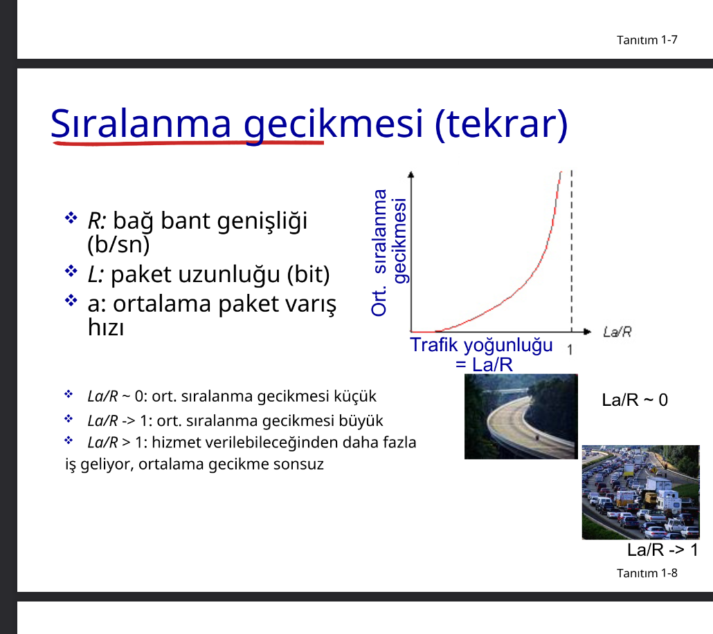
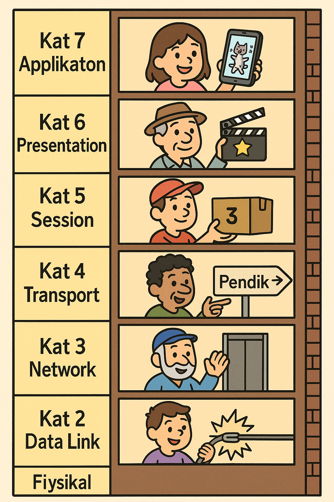

## Slayt 1 

#### Soru: Uç sistemleri kenar yönlendiriciye nasıl bağlarız?

- Yerleşik erişim ağları
- Kurumsal erişim ağları (ör. okul, şirket)
- Mobil erişim ağları

#### Unutulmaması Gerekenler:

- Erişim ağlarının bant genişliği (bits/saniye)?
- Paylaşımlı mı? Ayrılmış mı?

***startofai

# Uç Sistemleri Kenar Yönlendiriciye Nasıl Bağlanır?

Uç sistemleri (bilgisayarlar, telefonlar, yazıcılar vb.), **kenar yönlendiriciye** (edge router) **erişim ağları** aracılığıyla bağlanır. Bu ağlar üç ana gruba ayrılır:

---

## 1. 🏠 Yerleşik Erişim Ağları (Residential Access Networks)

Ev kullanıcıları tarafından kullanılır.

- **DSL (Digital Subscriber Line):** Telefon hattı üzerinden internet sağlar.  
- **Kablo İnternet:** TV kablosu üzerinden yüksek hızlı bağlantı.  
- **Fiber Optik:** En hızlı erişim şeklidir, doğrudan eve fiber kablo gelir.  
- **Wi-Fi:** Modem üzerinden ev içi kablosuz bağlantı.

**Bant Genişliği:**
- Genellikle **paylaşımlı**dır.
- Aynı mahalledeki kullanıcılar aynı altyapıyı paylaşır.
- **Tipik hızlar:** 10 Mbps – 1 Gbps

---

## 2. 🏢 Kurumsal Erişim Ağları (Institutional/Enterprise Access Networks)

Şirketler, okullar, hastaneler gibi kurumlar tarafından kullanılır.

- **Ethernet LAN:** Kablolu bağlantı, yüksek hız ve kararlılık sağlar.  
- **Wi-Fi:** Kurumsal güvenlik seviyesinde kablosuz bağlantı.  
- **VPN:** Dış ağdan kurumsal ağa güvenli erişim için kullanılır.

**Bant Genişliği:**
- Genellikle **ayrılmış**tır veya yöneticiler tarafından yönetilir.
- Kullanıcılar için belirli hızlar atanabilir.
- **Tipik hızlar:** 100 Mbps – 10 Gbps

---

## 3. 📱 Mobil Erişim Ağları (Mobile Access Networks)

Cep telefonları, tabletler ve mobil cihazlar içindir.

- **4G/5G/LTE:** Operatör bazlı mobil bağlantılar.  
- **Mobil hotspot:** Telefon veya cihaz üzerinden internet paylaşımı.

**Bant Genişliği:**
- Genellikle **paylaşımlı**dır.
- Aynı baz istasyonuna bağlı tüm kullanıcılar bant genişliğini paylaşır.
- **Tipik hızlar:**
  - 4G: 10–100 Mbps  
  - 5G: 100 Mbps – 1 Gbps+

---

## ❗ "Paylaşımlı mı? Ayrılmış mı?" Açıklaması

| Özellik       | Paylaşımlı                                | Ayrılmış                                  |
|---------------|--------------------------------------------|--------------------------------------------|
| **Tanım**      | Aynı bağlantıyı birden çok kullanıcı paylaşır | Her kullanıcıya özel bir bant genişliği sağlanır |
| **Örnek**      | Kablo internet, mobil şebekeler           | Kurumsal Ethernet bağlantısı               |
| **Avantaj**    | Daha ucuz ve yaygın                       | Daha hızlı ve kararlı bağlantı             |
| **Dezavantaj** | Yoğun saatlerde hız düşebilir             | Maliyet daha yüksektir                     |

---

Bu bilgiler, uç sistemlerin internete nasıl bağlandığını ve bağlantının doğasına göre değişen özellikleri anlamak için önemlidir.
***endofai

### DSLAM (Digital Subscriber Line Access Multiplexer)

> DSLAM, internet servis sağlayıcılarının kullanıcılarına DSL teknolojisi üzerinden internet erişimi sağlamak için kullandığı bir cihazdır. Telefon hatları üzerinden gelen sinyalleri alır ve bunları yüksek hızlı dijital sinyallere dönüştürerek ağ altyapısına iletir.

Frekans bölüşümlü çoğullama:
Farklı frekans kümelerinde farklı kanallar iletilir. 

### Cihaz Gönderim Fonksiyonu

(paket iletim gecikmesi) ***L-bit paketi bağ üzerine  iletmek için  gereken süre*** = L(bit) / R (bps) = L/R (saniye)
- L: paket uzunluğu (bit cinsinden)
- R: iletim hızı (bps cinsinden)
- L/R: iletim süresi (saniye cinsinden)

14, 15 atlandı ***common knowledge***

### Ağ Çekirdeği

**paket-anahtarlama**: cihazlar uygulama katmanı mesajlarını paketlere ayırır.

#### Paket Anahtarlama

L bitlik bir paketi, R bps kapasiteli bir bağa göndermek için gereken süre **L/R saniyedir**.

- **Sakla-ve-Yolla:** Bir sonraki bağa gönderebilmek için paketin tamamının yönlendiriciye ulaşması gerekir.

### Bir-Durak Sayısal Örnek:
- **L = 7.5 Mbits**  
- **R = 1.5 Mbps**  
- **Bir-durak iletim gecikmesi = 5 saniye**

sıralama ve kayıp: 
- Eğer geliş hızı (bit) bir süre zarfında iletim hızını geçerse:
  - Paketler sıraya girer, gönderilmeyi beklemeye başlarlar.
  - Eğer yönlendiricinin hafızası (buffer) dolarsa, paketler düşürülebilir (kayıp).

  ***common knowledge***

  **routing**: yönlendirici, gelen paketi alır ve hedef adresine göre yönlendirir. Bu işlem, yönlendirme tablosu kullanılarak yapılır. Yönlendirme tablosu, hangi paketin hangi çıkışa yönlendirileceğini belirler.

  
 
### Mb/s Bağlantı

- **Her kullanıcı:**
    - 100 kb/s hızında "aktif" olduğunda.
    - Zamanın %10'unda aktif.

#### Devre-Anahtarlama:
- 10 kullanıcı desteklenir.

#### Paket Anahtarlama:
- 35 kullanıcı ile, 11 veya daha fazla kullanıcının aynı anda aktif olma olasılığı < 0.0004.
- Paket anahtarlama, daha fazla kullanıcının ağı kullanmasına olanak sağlar.

**Sorular ve Cevaplar:**

1. **0.0004 olasılığını nasıl hesapladık?**  
     Bu olasılık, **binom dağılımı** veya **Poisson dağılımı** kullanılarak hesaplanır.  
     - Her kullanıcının aktif olma olasılığı %10 (0.1).  
     - 35 kullanıcıdan 11 veya daha fazlasının aynı anda aktif olma olasılığı, bu dağılımlar yardımıyla hesaplanır.  
     - Örneğin, Poisson yaklaşımı: λ = 35 × 0.1 = 3.5 (ortalama aktif kullanıcı sayısı).  
         Daha sonra, P(X ≥ 11) hesaplanır.

2. **35 kullanıcıdan fazla olursa ne olur?**  
     - Daha fazla kullanıcı eklenirse, aynı anda aktif olan kullanıcı sayısının artma olasılığı yükselir.  
     - Bu, ağda **tıkanıklık** (congestion) yaratabilir ve paket kaybına veya gecikmelere neden olabilir.  
     - Paket anahtarlama, bu durumu yönetmek için daha esnektir, ancak yine de ağ performansı düşebilir.

#### Genel Durum:
- **N kullanıcı** için:
  - 1 Mbps bağlantı.
  - Her kullanıcı belirli bir süre aktif olur.

Özellik | FDM (Frekans Bölmeli Çoklama) | TDM (Zaman Bölmeli Çoklama)
Çalışma Prensibi | Her kullanıcıya farklı frekans bandı atanır | Her kullanıcıya farklı zaman dilimi atanır
Kanal Kullanımı | Tüm kullanıcılar aynı anda farklı frekanslarda iletim yapar | Kullanıcılar sırayla veri gönderir
Eşzamanlılık | Evet (aynı anda veri iletimi) | Hayır (sırayla veri iletimi)
Donanım Gereksinimi | Frekans filtreleri gerekir | Zamanlama devreleri gerekir
Senaryo Örneği | Radyo ve televizyon yayınları | Telefon santralleri, dijital veri ağları
Bant Genişliği Kullanımı | Geniş bant gerektirir | Daha dar bant yeterlidir
Verim | Frekanslar boşa harcanabilir (kullanıcı veri göndermese bile) | Zaman dilimi boşsa boşa harcanır
Gecikme | Düşük | Kullanıcının sırası gelene kadar beklenir (gecikme olabilir)

### Paket Anahtarlamalı vs Devre Anahtarlamalı

Patlamalı veri akışı için oldukça kullanışlıdır:
- Kaynak paylaşımına izin verir.
- Daha basittir, çağrı kurulumu yoktur.

Aşırı sıkışıklık olabilir: paket gecikmesi ve kaybı.
- Bu nedenle güvenilir veri transferi ve sıkışıklık kontrolü için protokoller gereklidir.

#### Soru 1: Devre davranışı nasıl sağlanabilir?
- Ses ve görüntü uygulamaları için bant genişliği garantisi verilmelidir.
- Ancak, bu halen çözülmemiş bir problemdir (bölüm 7'ye bakınız).

#### Soru 2: Paket anahtarlama her zaman daha mı iyidir?
- İnsan ilişkilerinden örnekler:
    - **Devre Anahtarlama:** Rezerve edilen kaynaklar, örneğin bir telefon görüşmesi sırasında iki taraf arasında ayrılmış bir bağlantı.
    - **Paket Anahtarlama:** İstek anında ayrılan kaynaklar, örneğin bir e-posta gönderimi veya web taraması.

**Not:** Her iki yöntem de farklı kullanım senaryolarında avantaj ve dezavantajlara sahiptir.

### Paket Anahtarlama ve Devre Anahtarlama
- **Paket Anahtarlama:** Veriyi küçük paketler halinde gönderir, her paketin bağımsız olarak yönlendirilmesini sağlar.
- **Devre Anahtarlama:** Veriyi sürekli bir bağlantı üzerinden gönderir, kaynakları rezerve eder.
- **Avantajları:**
  - Paket anahtarlama: Daha esnek, daha fazla kullanıcıya hizmet verebilir.
  - Devre anahtarlama: Daha az gecikme, daha güvenilir bağlantı sağlar.
- **Dezavantajları:**
    - Paket anahtarlama: Gecikme ve paket kaybı riski.
    - Devre anahtarlama: Kaynak israfı, daha az esneklik.
### İnsan İlişkilerinden Örnekler

#### Devre Anahtarlama (Rezerve Edilen Kaynaklar)
- **Örnek:** Bir restoranda masa rezervasyonu yapmak.  
    - Rezervasyon yapıldığında, masa yalnızca sizin için ayrılır ve başka kimse tarafından kullanılamaz.  
    - Bu, kaynakların (masa) belirli bir süre boyunca yalnızca bir kullanıcıya tahsis edilmesini temsil eder.

#### Paket Anahtarlama (İstek Anında Ayrılan Kaynaklar)
- **Örnek:** Bir kafeteryada sıraya girip sipariş vermek.  
    - Siparişinizi verdiğinizde, kaynaklar (örneğin, kahve makinesi) sırayla herkes tarafından kullanılır.  
    - Bu, kaynakların talep üzerine dinamik olarak paylaşılmasını temsil eder.

### Ağların ağı
 - Milyonlarca erişim ve ISP vardır. Bu, tüm bu ISP'lerin birleri ile de ilieitşimini bir gerek ve yeter kılar. 

Milyonlarca erişim ISP var ise, bunların her birini  nasıl baylayacağız?

Her bir ISP diğerine doğru bir yolla bağlanır denebilir denir?

Eğer her bir ISP diğerine doğru bir yolla bağlanır denirse, bu durumda 

***ai***
Her ISP bir global ISP’ye bağlanır. 
Tüketici ve sağlayıcı ISP’ler arasında ekonomik anlaşmalar yapılır.
- **Tier 1 ISP:** Global ağ sağlayıcılarıdır. Diğer ISP'lerle peering anlaşmaları yapar.
- **Tier 2 ISP:** Yerel veya bölgesel ağ sağlayıcılarıdır. Tier 1 ISP'lerle peering yapar.
- **Tier 3 ISP:** Son kullanıcıya hizmet veren küçük ağ sağlayıcılarıdır. Tier 2 ISP'lerle bağlantı kurar.
- **Peering:** İki ISP'nin birbirleriyle doğrudan bağlantı kurmasıdır. Bu, veri trafiğinin daha hızlı ve maliyet etkin bir şekilde yönlendirilmesini sağlar.
- **Transit:** Bir ISP'nin diğerine veri trafiği için ödeme yapmasıdır. Bu, genellikle daha büyük ISP'ler arasında gerçekleşir.
- **Peering anlaşmaları:** İki ISP'nin birbirlerine veri trafiği için ödeme yapmadan doğrudan bağlantı kurmasıdır. Bu, genellikle eşit büyüklükteki ISP'ler arasında gerçekleşir.
- **Transit anlaşmaları:** Bir ISP'nin diğerine veri trafiği için ödeme yapmasıdır. Bu, genellikle daha büyük ISP'ler ile daha küçük ISP'ler arasında gerçekleşir.
***endofai***

>   bölgesel net: A regional network that connects users and organizations      within a specific geographic area, often serving as a bridge to larger global networks.
>   IXP: An Internet Exchange Point is a physical location where networks exchange internet traffic to improve speed, reduce costs, and enhance reliability.
>    Bölgesel Net
>   This term translates to "regional network" in English. It typically refers to a network infrastructure that operates within a specific geographic region. These networks are often used to connect local users, businesses, or institutions to each other and to larger global networks.

>Example Use Case: A regional network might connect schools, hospitals, and government offices within a city or province.
>Relation to the Internet: Regional networks often act as intermediaries between local networks (like home or office networks) and larger backbone networks.
>2. IXP (Internet Exchange Point)
>An Internet Exchange Point is a physical location where different networks (e.g., ISPs, content delivery networks, and enterprise networks) meet to exchange internet traffic. The goal of an IXP is to improve the efficiency and speed of data transfer by keeping local traffic local.

>Key Benefits:

>Reduces latency by avoiding long-distance routing.
>Lowers costs for ISPs by reducing the need for upstream transit providers.
>Improves redundancy and reliability of internet connections.
Example: If two ISPs in the same city exchange traffic through an IXP, users of those ISPs can communicate faster and more efficiently.

> içerik sağlama ağı (e.g, Google): Veri merkezlerini İnternet ağına 
> bağlayan özel ağlar, genellikle tabaka-1 ISP’leri ve bölgesel ISP’leri pas 
> geçer

Yönlendirici önbelleklerinde paketler sıraya girebilir.
- Bağ üzerindeki paket varış hızı (bir süre için) paket çıktı kapasitesini aşabilir.
- Bu durumda paketler sıraya girip sıranın kendilerine gelmesini bekler.

d (düğüm) = d (işlem) + d (sıra) + d (iletim) + d(yayılma)

### Gecikme Türleri

#### 1. Düğüm İşlem Gecikmesi (d_işlem)
- **Tanım:** Düğümde gerçekleştirilen işlemlerden kaynaklanan gecikme.
- **İşlemler:**
  - Bit hatalarının kontrolü.
  - Çıktı bağına karar verme.
- **Tipik Süre:** Genellikle < 1 ms.

#### 2. Sıralanma Gecikmesi (d_sıralanma)
- **Tanım:** Paketlerin iletim için çıktı bağını bekleme süresi.
- **Bağımlılık:** Yönlendirici üzerindeki sıkışmaya bağlıdır.

#### 3. İletim Gecikmesi (d_iletim)
- **Tanım:** Paketin bir bağ üzerinden iletilmesi için geçen süre.
- **Formül:** 
  - \( d_{iletim} = \frac{L}{R} \)
  - \( L \): Paket uzunluğu (bit).
  - \( R \): Bağ bant genişliği (bit/s).

#### 4. Yayılma Gecikmesi (d_yayılma)
- **Tanım:** Sinyalin fiziksel bağ boyunca yayılması için geçen süre.
- **Formül:** 
  - \( d_{yayılma} = \frac{d}{s} \)
  - \( d \): Fiziksel bağın uzunluğu.
  - \( s \): Ortamda yayılma hızı (~\( 2 \times 10^8 \) m/s).

***endofchapter1***

## Slayt 2

***already mentioned***

Önceki bağ ait sıra (veya önbellek) belli bir 
kapasiteye sahiptir.
- Dolmuş bir sıraya gelen paketler düşürülür 
  (kayıp).
- Kaybolan paket önceki düğüm veya kaynak uç 
  sistemi tarafından tekrar iletilebilir ya da tekrar 
  iletilmez.

  ## İş hacmi
    - Bir düğümden diğerine iletilen toplam veri miktarıdır. 
    - İş hacmi: Bir düğümden geçen toplam bit sayısı.
    - İş hacmi = bit/saniye x saniye
**darboğaz bağ**: iş hacmi üzerinde kısıtlayıcı bağ
paketin kaybolduktan sonra tekrar iletilip iletilmeyeceğini belirleyen şey protokoldür

🌐 İnternette İş Hacmi (Throughput) ve Darboğaz Mantığı

Bir uçtan uca bağlantıda (örneğin bir client’tan server’a veri gönderdiğimizde) veri aktarım hızını etkileyen 3 temel sınır vardır:

    Rc → Client'ın gönderme kapasitesi (gönderici hız limiti)

    Rs → Server'ın alma kapasitesi (alıcı hız limiti)

    R → Aradaki omurga hattının kapasitesi (paylaşılan ağ – örneğin internet omurgası)

Eğer 10 farklı bağlantı aynı anda bu R kapasiteli omurgayı kullanıyorsa, adil paylaşım varsayımıyla her biri R / 10 kapasiteye sahip olur.
📌 Temel Formül:

Her bağlantının uçtan uca veri aktarım kapasitesi:
▶️ min(Rc, Rs, R/10)

Bu demek oluyor ki:

    En yavaş kısımdan fazla veri geçemez.

    Yani "en dar boru" hangisiyse o belirleyici olur.

📊 Duruma Göre Örnekler:
1. Client Darboğaz (Rc en düşük)

    Rc = 2 Mbps

    Rs = 10 Mbps

    R = 50 Mbps → R/10 = 5 Mbps

    👉 min(2, 10, 5) = 2 Mbps

    Client gönderemediği için sistem onun hızına uyar.

2. Server Darboğaz

    Rc = 10 Mbps

    Rs = 3 Mbps

    R = 50 Mbps → R/10 = 5 Mbps

    👉 min(10, 3, 5) = 3 Mbps

    Server bu kadar alabiliyor, hız burada kısıtlanıyor.

3. Omurga Darboğaz

    Rc = 10 Mbps

    Rs = 10 Mbps

    R = 30 Mbps → R/10 = 3 Mbps

    👉 min(10, 10, 3) = 3 Mbps

    Client ve server hızlı ama ağ kapasitesi yeterli değil, burada tıkanıyor.

🧠 Notlar:

    Rc (client rate): Kullanıcının evindeki internet upload/download kapasitesi olabilir. Örn: mobil veri, Wi-Fi vb.

    Rs (server rate): Hizmet sağlayan sunucunun bağlantı kapasitesi. Örn: Spotify, YouTube sunucuları.

    R: İnternetteki ortak boru hattı gibi. Aynı anda birçok kullanıcı paylaşır. Büyük sistemlerde bu omurga ağı olur.

🎓 Pratikte Ne Olur?

Çoğunlukla:

    Ev kullanıcısında Rc düşüktür (upload genelde kötüdür).

    Mobilde R/10 düşer, çünkü aynı baz istasyonunu herkes kullanır.

    Serverlar genelde güçlüdür ama seninle aradaki ağ darboğaz olabilir.

    **Katmanlama **gerek ve yeterdir**
    atmanlama = Her katman sadece kendi işini yapar

Her katmanın belirli görevleri ve sorumlulukları vardır. Bu da hem gereklidir hem de yeterlidir, çünkü:
✅ Gerekli çünkü:

    Birbirinden bağımsız sistemleri (donanım, yazılım) uyumlu hale getirir.

    Standartlaştırmayı sağlar: TCP/IP, HTTP gibi protokoller her yerde çalışabilir.

    Hatalar daha rahat izlenir, sorun çözmek kolaylaşır.

✅ Yeter çünkü:

    Her katman sadece kendi alt ve üst katmanıyla konuşur.

    Yukarıdan gelen veriyi işleyip alttakine geçirir → bu işlem zinciri iletişimi baştan sona sağlar.

    Böylece interneti global, ölçeklenebilir ve bakımı kolay bir hale getirir.

📶 OSI ya da TCP/IP Katmanlarıyla Bağlayalım:
Katman (OSI)	Ne işe yarar?
7 - Uygulama	Kullanıcıya en yakın: WhatsApp, HTTP
6 - Sunum	Şifreleme, sıkıştırma
5 - Oturum	Bağlantı yönetimi
4 - Taşıma (TCP/UDP)	Paketleri sıralı ve güvenli yolla yolla
3 - Ağ (IP)	Hangi bilgisayara gidecek? (Routing)
2 - Veri Bağlantısı	Hangi cihazla? (MAC adresi)
1 - Fiziksel	Elektrik, fiber, kablosuz sinyal

Her biri sadece altındakini kullanarak çalışıyor. Bu da sistemin hem modüler hem sürdürülebilir olmasını sağlıyor.
🎯 Özet: Katmanlama Neden Gerekli ve Yeterlidir?

✅ Gerekli çünkü:

    Karmaşıklığı azaltır.

    Sistemler arası uyumu sağlar.

    Arızayı izole etmeye yardımcı olur.

✅ Yeterlidir çünkü:

    Her katman yalnızca kendi işini yapar.

    Alt ve üst katmanla konuşarak tüm sistem çalışır.

    Tek bir zincirle global ağ kurulabilir.

    

    katmanlı yapının bazı dezavantajları da vardır. Her şey güllük gülistanlık değil 😄 İşte bazı olumsuz yönleri:
🐌 1. Performans Kaybı

Her katman veriyi işleyip bir sonraki katmana ilettiği için:

    Paket başlıkları eklenir (overhead),

    Gecikme artabilir (her katman sırasını bekler),

    Bazı işlemler yinelenebilir (örneğin şifreleme üstte de altta da olabilir).

    Özellikle gerçek zamanlı uygulamalarda (VoIP, oyunlar) bu katmanlar biraz “yavaşlatıcı faktör” olabilir.

🧱 2. Esneklik Azalabilir

Katmanlar birbirine sıkı bağlı değil gibi görünse de:

    Bazen alt katmanda bir şey değiştirmek istersin ama üst katman etkilenir.

    Tersine mühendislik veya özelleştirme yapmak zorlaşır.

📦 3. Fazla Veri Taşıma (Overhead)

Her katman kendi başlığını ekler:

    TCP başlığı, IP başlığı, Ethernet başlığı… derken bir mesajın %30’u sadece "zarf" olur.

    Bu da bant genişliğini boşa harcayabilir.

🤷‍♂️ 4. Teorik Katmanlar Gerçekte Karışır

    OSI gibi modellerde 7 katman var ama uygulamada TCP/IP 4 katmanla çalışır.

    Yani bazı katmanlar teorik kalır, pratikte tam uygulanmaz.

🔧 5. Katı Kurallar: İnovasyonu Engelleyebilir

    “Bu katmanda şu yapılamaz” gibi kurallar bazen yeni teknolojilere engel olabilir.

    Örneğin uygulama katmanı bazı özel protokolleri kullanmak isteyebilir ama TCP/IP sınırlıdır.

#### Page 22
Kapsülleme, bir üst katmanın verisini alıp, kendi başlığını (header) ekleyerek alt katmana iletme işlemidir.

Kapsülleme, her katmanın üst katmandan gelen veriyi alıp kendi kontrol bilgisiyle sarmalayıp (header ekleyip) alt katmana vermesidir. Veri hedefe ulaştığında, katmanlar sırayla bu başlıkları çıkarır (decapsulation) ve mesaj nihayet uygulamaya ulaşır.

📌 Nedir bu Kalıcı & Kalıcı Olmayan TCP?
🔁 1. Kalıcı Olmayan TCP (HTTP/1.0 classic)

    Her dosya (HTML, CSS, resim vs.) için ayrı TCP bağlantısı açılır.

    Dosya alınır, sonra bağlantı kapanır.

    Yeni dosya? → Yeni TCP aç, yine kapat.

🔗 2. Kalıcı TCP (Persistent, pipelined – HTTP/1.1 ve sonrası)

    Bir kere TCP bağlantısı kurulur.

    Aynı bağlantı üzerinden birden fazla dosya istenir.

    Hatta pipeline varsa birden fazla istek ardı ardına gönderilir, cevaplar sırayla alınır.

🧠 Kaç RTT Sürer?
🧮 Temel Bilgiler:

    RTT (Round Trip Time): Bir paketin karşıya gidip cevabın dönmesi süresi.

    TCP bağlantısı kurmak = 1 RTT (3-way handshake)

    HTTP isteği gönderip cevabı almak = 1 RTT

🧪 Senaryo: Tarayıcı bir HTML dosyası + 2 resim alacak
1. Kalıcı Olmayan TCP (Non-persistent HTTP/1.0)

Her dosya için:

    1 RTT → TCP bağlantısı kur

    1 RTT → HTTP isteği gönder + cevabı al

Yani:

    HTML dosyası: 2 RTT

    Resim 1: 2 RTT

    Resim 2: 2 RTT

Toplam: 6 RTT
Ve her seferinde bağlantı aç-kapat işlemiyle ekstra maliyet.
2. Kalıcı TCP (Persistent HTTP/1.1)

Tüm dosyalar aynı bağlantı üzerinden:

    1 RTT → TCP bağlantısı kur

    1 RTT → HTML isteği + cevabı

    Sonraki dosyalar: aynı bağlantıdan, bazen aynı RTT içinde istenir

Toplam:

    2 RTT (HTML için)

        1 RTT (iki resmi sırayla almak için)

    Pipeline varsa tek RTT’ye bile düşebilir!

🔢 Toplam: 3 RTT (veya 2’ye kadar düşebilir)
🥊 Karşılaştırma Tablosu:
Özellik	Non-Persistent (HTTP/1.0)	Persistent (HTTP/1.1+)
Bağlantı sayısı	Her dosya için ayrı	Tek bağlantı
RTT sayısı (örnekte)	6 RTT	2-3 RTT
Performans	Daha yavaş	Daha hızlı
Ek yük (overhead)	Yüksek	Düşük
🧠 Sonuç:

Kalıcı TCP bağlantıları:

    Hızlıdır, verimlidir, daha az RTT harcar.

    Modern tarayıcıların ve HTTP/1.1+'ın standart halidir.

    Bir sayfa çok sayıda kaynak içeriyorsa büyük fark yaratır.

    ALI (istek) -> SUNUCU
    SUNUCU -> ALI (kurabiye)
    ALI (istek & kurabiye) -> SUNUCU -> Kurabiye? var kaydet neyi? x sitesinin x/y adresini t kategoprisinde ürünü şu tarihte şu kadar arayarak baktı 

    MARK suckerberg -> hmmm yarrak 

    ALI-> isntagram -> mark suckerberg ->  x ürünüü ,ster msiin

    ALİ _> sunucu
    sunucu -> sen ali misin? 
    ali -> evet
    sunucu -> tamam AL bunu kaydet Kurabiye
    ali -> tmm dedi
    ali (kurabiye) -> sunucu 
    sunuc -> naber ali 