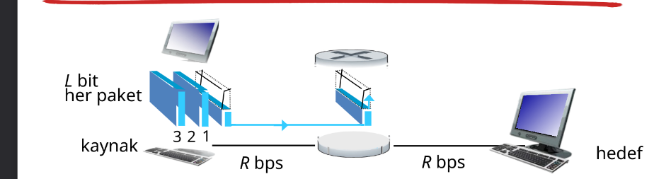
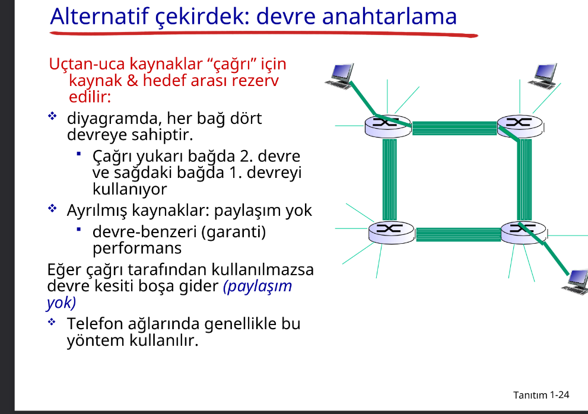
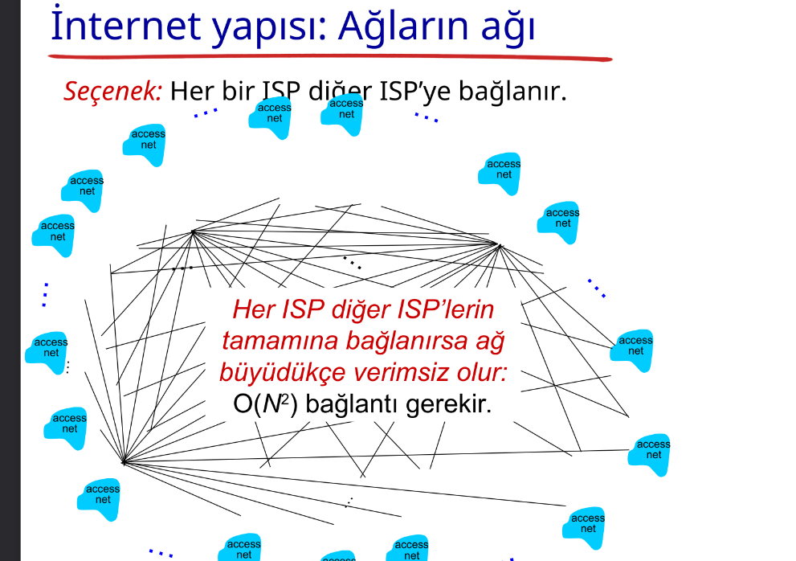
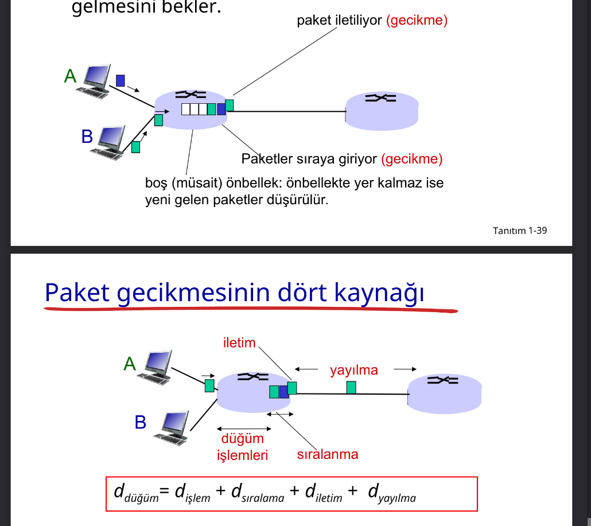

## Slayt 1 

#### Soru: Uç sistemleri kenar yönlendiriciye nasıl bağlarız?

- Yerleşik erişim ağları
- Kurumsal erişim ağları (ör. okul, şirket)
- Mobil erişim ağları

#### Unutulmaması Gerekenler:

- Erişim ağlarının bant genişliği (bits/saniye)?
- Paylaşımlı mı? Ayrılmış mı?

***startofai

# Uç Sistemleri Kenar Yönlendiriciye Nasıl Bağlanır?

Uç sistemleri (bilgisayarlar, telefonlar, yazıcılar vb.), **kenar yönlendiriciye** (edge router) **erişim ağları** aracılığıyla bağlanır. Bu ağlar üç ana gruba ayrılır:

---

## 1. 🏠 Yerleşik Erişim Ağları (Residential Access Networks)

Ev kullanıcıları tarafından kullanılır.

- **DSL (Digital Subscriber Line):** Telefon hattı üzerinden internet sağlar.  
- **Kablo İnternet:** TV kablosu üzerinden yüksek hızlı bağlantı.  
- **Fiber Optik:** En hızlı erişim şeklidir, doğrudan eve fiber kablo gelir.  
- **Wi-Fi:** Modem üzerinden ev içi kablosuz bağlantı.

**Bant Genişliği:**
- Genellikle **paylaşımlı**dır.
- Aynı mahalledeki kullanıcılar aynı altyapıyı paylaşır.
- **Tipik hızlar:** 10 Mbps – 1 Gbps

---

## 2. 🏢 Kurumsal Erişim Ağları (Institutional/Enterprise Access Networks)

Şirketler, okullar, hastaneler gibi kurumlar tarafından kullanılır.

- **Ethernet LAN:** Kablolu bağlantı, yüksek hız ve kararlılık sağlar.  
- **Wi-Fi:** Kurumsal güvenlik seviyesinde kablosuz bağlantı.  
- **VPN:** Dış ağdan kurumsal ağa güvenli erişim için kullanılır.

**Bant Genişliği:**
- Genellikle **ayrılmış**tır veya yöneticiler tarafından yönetilir.
- Kullanıcılar için belirli hızlar atanabilir.
- **Tipik hızlar:** 100 Mbps – 10 Gbps

---

## 3. 📱 Mobil Erişim Ağları (Mobile Access Networks)

Cep telefonları, tabletler ve mobil cihazlar içindir.

- **4G/5G/LTE:** Operatör bazlı mobil bağlantılar.  
- **Mobil hotspot:** Telefon veya cihaz üzerinden internet paylaşımı.

**Bant Genişliği:**
- Genellikle **paylaşımlı**dır.
- Aynı baz istasyonuna bağlı tüm kullanıcılar bant genişliğini paylaşır.
- **Tipik hızlar:**
  - 4G: 10–100 Mbps  
  - 5G: 100 Mbps – 1 Gbps+

---

## ❗ "Paylaşımlı mı? Ayrılmış mı?" Açıklaması

| Özellik       | Paylaşımlı                                | Ayrılmış                                  |
|---------------|--------------------------------------------|--------------------------------------------|
| **Tanım**      | Aynı bağlantıyı birden çok kullanıcı paylaşır | Her kullanıcıya özel bir bant genişliği sağlanır |
| **Örnek**      | Kablo internet, mobil şebekeler           | Kurumsal Ethernet bağlantısı               |
| **Avantaj**    | Daha ucuz ve yaygın                       | Daha hızlı ve kararlı bağlantı             |
| **Dezavantaj** | Yoğun saatlerde hız düşebilir             | Maliyet daha yüksektir                     |

---

Bu bilgiler, uç sistemlerin internete nasıl bağlandığını ve bağlantının doğasına göre değişen özellikleri anlamak için önemlidir.
***endofai

### DSLAM (Digital Subscriber Line Access Multiplexer)

> DSLAM, internet servis sağlayıcılarının kullanıcılarına DSL teknolojisi üzerinden internet erişimi sağlamak için kullandığı bir cihazdır. Telefon hatları üzerinden gelen sinyalleri alır ve bunları yüksek hızlı dijital sinyallere dönüştürerek ağ altyapısına iletir.

Frekans bölüşümlü çoğullama:
Farklı frekans kümelerinde farklı kanallar iletilir. 

### Cihaz Gönderim Fonksiyonu

(paket iletim gecikmesi) ***L-bit paketi bağ üzerine  iletmek için  gereken süre*** = L(bit) / R (bps) = L/R (saniye)
- L: paket uzunluğu (bit cinsinden)
- R: iletim hızı (bps cinsinden)
- L/R: iletim süresi (saniye cinsinden)

14, 15 atlandı ***common knowledge***

### Ağ Çekirdeği

**paket-anahtarlama**: cihazlar uygulama katmanı mesajlarını paketlere ayırır.

#### Paket Anahtarlama

L bitlik bir paketi, R bps kapasiteli bir bağa göndermek için gereken süre **L/R saniyedir**.

- **Sakla-ve-Yolla:** Bir sonraki bağa gönderebilmek için paketin tamamının yönlendiriciye ulaşması gerekir.

### Bir-Durak Sayısal Örnek:
- **L = 7.5 Mbits**  
- **R = 1.5 Mbps**  
- **Bir-durak iletim gecikmesi = 5 saniye**

sıralama ve kayıp: 
- Eğer geliş hızı (bit) bir süre zarfında iletim hızını geçerse:
  - Paketler sıraya girer, gönderilmeyi beklemeye başlarlar.
  - Eğer yönlendiricinin hafızası (buffer) dolarsa, paketler düşürülebilir (kayıp).

  ***common knowledge***

  **routing**: yönlendirici, gelen paketi alır ve hedef adresine göre yönlendirir. Bu işlem, yönlendirme tablosu kullanılarak yapılır. Yönlendirme tablosu, hangi paketin hangi çıkışa yönlendirileceğini belirler.

  
 
### Mb/s Bağlantı

- **Her kullanıcı:**
    - 100 kb/s hızında "aktif" olduğunda.
    - Zamanın %10'unda aktif.

#### Devre-Anahtarlama:
- 10 kullanıcı desteklenir.

#### Paket Anahtarlama:
- 35 kullanıcı ile, 11 veya daha fazla kullanıcının aynı anda aktif olma olasılığı < 0.0004.
- Paket anahtarlama, daha fazla kullanıcının ağı kullanmasına olanak sağlar.

**Sorular ve Cevaplar:**

1. **0.0004 olasılığını nasıl hesapladık?**  
     Bu olasılık, **binom dağılımı** veya **Poisson dağılımı** kullanılarak hesaplanır.  
     - Her kullanıcının aktif olma olasılığı %10 (0.1).  
     - 35 kullanıcıdan 11 veya daha fazlasının aynı anda aktif olma olasılığı, bu dağılımlar yardımıyla hesaplanır.  
     - Örneğin, Poisson yaklaşımı: λ = 35 × 0.1 = 3.5 (ortalama aktif kullanıcı sayısı).  
         Daha sonra, P(X ≥ 11) hesaplanır.

2. **35 kullanıcıdan fazla olursa ne olur?**  
     - Daha fazla kullanıcı eklenirse, aynı anda aktif olan kullanıcı sayısının artma olasılığı yükselir.  
     - Bu, ağda **tıkanıklık** (congestion) yaratabilir ve paket kaybına veya gecikmelere neden olabilir.  
     - Paket anahtarlama, bu durumu yönetmek için daha esnektir, ancak yine de ağ performansı düşebilir.

#### Genel Durum:
- **N kullanıcı** için:
  - 1 Mbps bağlantı.
  - Her kullanıcı belirli bir süre aktif olur.

### Paket Anahtarlamalı vs Devre Anahtarlamalı

Patlamalı veri akışı için oldukça kullanışlıdır:
- Kaynak paylaşımına izin verir.
- Daha basittir, çağrı kurulumu yoktur.

Aşırı sıkışıklık olabilir: paket gecikmesi ve kaybı.
- Bu nedenle güvenilir veri transferi ve sıkışıklık kontrolü için protokoller gereklidir.

#### Soru 1: Devre davranışı nasıl sağlanabilir?
- Ses ve görüntü uygulamaları için bant genişliği garantisi verilmelidir.
- Ancak, bu halen çözülmemiş bir problemdir (bölüm 7'ye bakınız).

#### Soru 2: Paket anahtarlama her zaman daha mı iyidir?
- İnsan ilişkilerinden örnekler:
    - **Devre Anahtarlama:** Rezerve edilen kaynaklar, örneğin bir telefon görüşmesi sırasında iki taraf arasında ayrılmış bir bağlantı.
    - **Paket Anahtarlama:** İstek anında ayrılan kaynaklar, örneğin bir e-posta gönderimi veya web taraması.

**Not:** Her iki yöntem de farklı kullanım senaryolarında avantaj ve dezavantajlara sahiptir.

### Paket Anahtarlama ve Devre Anahtarlama
- **Paket Anahtarlama:** Veriyi küçük paketler halinde gönderir, her paketin bağımsız olarak yönlendirilmesini sağlar.
- **Devre Anahtarlama:** Veriyi sürekli bir bağlantı üzerinden gönderir, kaynakları rezerve eder.
- **Avantajları:**
  - Paket anahtarlama: Daha esnek, daha fazla kullanıcıya hizmet verebilir.
  - Devre anahtarlama: Daha az gecikme, daha güvenilir bağlantı sağlar.
- **Dezavantajları:**
    - Paket anahtarlama: Gecikme ve paket kaybı riski.
    - Devre anahtarlama: Kaynak israfı, daha az esneklik.

### Ağların ağı
 - Milyonlarca erişim ve ISP vardır. Bu, tüm bu ISP'lerin birleri ile de ilieitşimini bir gerek ve yeter kılar. 

Milyonlarca erişim ISP var ise, bunların her birini  nasıl baylayacağız?

Her bir ISP diğerine doğru bir yolla bağlanır denebilir denir?

Eğer her bir ISP diğerine doğru bir yolla bağlanır denirse, bu durumda 

***ai***
Her ISP bir global ISP’ye bağlanır. 
Tüketici ve sağlayıcı ISP’ler arasında ekonomik anlaşmalar yapılır.
- **Tier 1 ISP:** Global ağ sağlayıcılarıdır. Diğer ISP'lerle peering anlaşmaları yapar.
- **Tier 2 ISP:** Yerel veya bölgesel ağ sağlayıcılarıdır. Tier 1 ISP'lerle peering yapar.
- **Tier 3 ISP:** Son kullanıcıya hizmet veren küçük ağ sağlayıcılarıdır. Tier 2 ISP'lerle bağlantı kurar.
- **Peering:** İki ISP'nin birbirleriyle doğrudan bağlantı kurmasıdır. Bu, veri trafiğinin daha hızlı ve maliyet etkin bir şekilde yönlendirilmesini sağlar.
- **Transit:** Bir ISP'nin diğerine veri trafiği için ödeme yapmasıdır. Bu, genellikle daha büyük ISP'ler arasında gerçekleşir.
- **Peering anlaşmaları:** İki ISP'nin birbirlerine veri trafiği için ödeme yapmadan doğrudan bağlantı kurmasıdır. Bu, genellikle eşit büyüklükteki ISP'ler arasında gerçekleşir.
- **Transit anlaşmaları:** Bir ISP'nin diğerine veri trafiği için ödeme yapmasıdır. Bu, genellikle daha büyük ISP'ler ile daha küçük ISP'ler arasında gerçekleşir.
***endofai***

>   bölgesel net: A regional network that connects users and organizations      within a specific geographic area, often serving as a bridge to larger global networks.
>   IXP: An Internet Exchange Point is a physical location where networks exchange internet traffic to improve speed, reduce costs, and enhance reliability.
>    Bölgesel Net
>   This term translates to "regional network" in English. It typically refers to a network infrastructure that operates within a specific geographic region. These networks are often used to connect local users, businesses, or institutions to each other and to larger global networks.

>Example Use Case: A regional network might connect schools, hospitals, and government offices within a city or province.
>Relation to the Internet: Regional networks often act as intermediaries between local networks (like home or office networks) and larger backbone networks.
>2. IXP (Internet Exchange Point)
>An Internet Exchange Point is a physical location where different networks (e.g., ISPs, content delivery networks, and enterprise networks) meet to exchange internet traffic. The goal of an IXP is to improve the efficiency and speed of data transfer by keeping local traffic local.

>Key Benefits:

>Reduces latency by avoiding long-distance routing.
>Lowers costs for ISPs by reducing the need for upstream transit providers.
>Improves redundancy and reliability of internet connections.
Example: If two ISPs in the same city exchange traffic through an IXP, users of those ISPs can communicate faster and more efficiently.

> içerik sağlama ağı (e.g, Google): Veri merkezlerini İnternet ağına 
> bağlayan özel ağlar, genellikle tabaka-1 ISP’leri ve bölgesel ISP’leri pas 
> geçer

Yönlendirici önbelleklerinde paketler sıraya girebilir.
- Bağ üzerindeki paket varış hızı (bir süre için) paket çıktı kapasitesini aşabilir.
- Bu durumda paketler sıraya girip sıranın kendilerine gelmesini bekler.

d (düğüm) = d (işlem) + d (sıra) + d (iletim) + d(yayılma)

### Gecikme Türleri

#### 1. Düğüm İşlem Gecikmesi (d_işlem)
- **Tanım:** Düğümde gerçekleştirilen işlemlerden kaynaklanan gecikme.
- **İşlemler:**
  - Bit hatalarının kontrolü.
  - Çıktı bağına karar verme.
- **Tipik Süre:** Genellikle < 1 ms.

#### 2. Sıralanma Gecikmesi (d_sıralanma)
- **Tanım:** Paketlerin iletim için çıktı bağını bekleme süresi.
- **Bağımlılık:** Yönlendirici üzerindeki sıkışmaya bağlıdır.

#### 3. İletim Gecikmesi (d_iletim)
- **Tanım:** Paketin bir bağ üzerinden iletilmesi için geçen süre.
- **Formül:** 
  - \( d_{iletim} = \frac{L}{R} \)
  - \( L \): Paket uzunluğu (bit).
  - \( R \): Bağ bant genişliği (bit/s).

#### 4. Yayılma Gecikmesi (d_yayılma)
- **Tanım:** Sinyalin fiziksel bağ boyunca yayılması için geçen süre.
- **Formül:** 
  - \( d_{yayılma} = \frac{d}{s} \)
  - \( d \): Fiziksel bağın uzunluğu.
  - \( s \): Ortamda yayılma hızı (~\( 2 \times 10^8 \) m/s).

***endofchapter1***